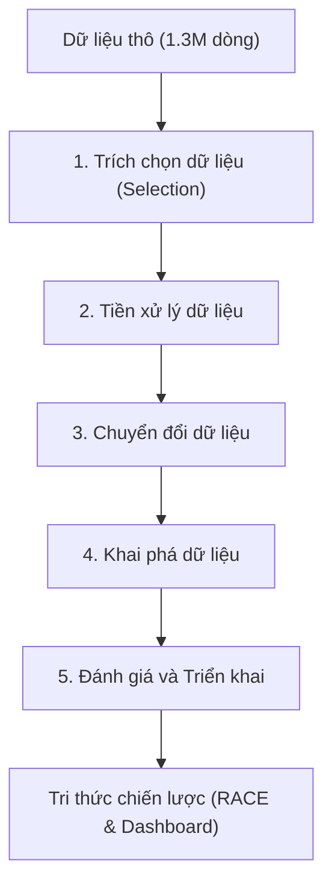

*Đầu trang (Header): Chương 1: Tổng quan về đề tài nghiên cứu*
*Chân trang (Footer): Sinh viên thực hiện: Ksor Phuk*

# CHƯƠNG 1: TỔNG QUAN VỀ ĐỀ TÀI NGHIÊN CỨU

## 1.1. ĐẶT VẤN ĐỀ VÀ TÍNH CẤP THIẾT CỦA ĐỀ TÀI
Trong những năm gần đây, sự bùng nổ của mạng lưới Internet toàn cầu, các thiết bị di động thông minh và sự phát triển vượt bậc của hạ tầng thanh toán số đã thúc đẩy nền kinh tế số Việt Nam phát triển với tốc độ vô cùng nhanh chóng. Trong xu thế đó, thương mại điện tử (TMĐT) đã khẳng định vị thế là một trong những động lực tăng trưởng cốt lõi của nền kinh tế. Theo số liệu thống kê chính thức từ Báo cáo Chỉ số Thương mại điện tử Việt Nam (EBI) do Hiệp hội Thương mại điện tử Việt Nam (VECOM) công bố, tốc độ tăng trưởng của TMĐT Việt Nam năm 2023 đạt khoảng 25%, với quy mô thị trường bán lẻ trực tuyến chạm mốc 25 tỷ USD, đưa Việt Nam trở thành một trong những quốc gia có tốc độ phát triển TMĐT nhanh nhất khu vực Đông Nam Á. Sự cạnh tranh khốc liệt giữa các đại siêu thị trực tuyến như Shopee, Lazada, TikTok Shop, Tiki và các website bán lẻ độc lập đã làm thay đổi hoàn toàn thói quen mua sắm của người tiêu dùng. Giờ đây, thay vì chỉ tiếp cận sản phẩm qua quảng cáo một chiều từ doanh nghiệp, khách hàng có xu hướng dựa vào các đánh giá, phản hồi thực tế của những người mua trước làm căn cứ đưa ra quyết định tiêu dùng. Nguồn thông tin phản hồi phi cấu trúc khổng lồ này được gọi chung là truyền miệng điện tử trực tuyến (electronic Word-of-Mouth - eWOM).

Đối với các nhà quản trị doanh nghiệp, eWOM là nguồn dữ liệu phản hồi thời gian thực vô cùng quý báu để nắm bắt trải nghiệm khách hàng và điều chỉnh chiến lược kinh doanh kịp thời. Theo phương thức quản lý truyền thống, các sàn TMĐT thường sử dụng hệ thống đánh giá bằng điểm số sao (Star-Rating) chạy từ 1 đến 5 sao làm thước đo mức độ hài lòng. Tuy nhiên, hệ thống chấm điểm định lượng này bộc lộ những hạn chế rất lớn và vô tình tạo ra các "điểm mù thông tin" nguy hại đối với nhà quản trị thương hiệu. Số sao chỉ là một chỉ số gộp (aggregate scalar indicator) phản ánh cảm xúc chung mang tính tương đối. Trên thực tế, một khách hàng có thể chấm đánh giá 4 sao (thể hiện mức độ hài lòng chung khá tốt) nhưng trong nội dung văn bản nhận xét lại viết: *"Sản phẩm dùng rất ưng ý, chất liệu đẹp và chắc chắn nhưng giao hàng quá chậm, chờ mất gần 2 tuần, shipper thái độ không tốt"*. Nếu doanh nghiệp chỉ tổng hợp số liệu trung bình về số sao, họ sẽ hoàn toàn bỏ qua khuyết điểm nghiêm trọng trong quy trình logistics và giao vận, từ đó làm giảm trực tiếp khả năng giữ chân khách hàng và năng lực cạnh tranh dài hạn. 

Do đó, nhu cầu trích xuất thông tin chi tiết và phân tích quan điểm đa chiều từ văn bản bình luận trở nên vô cùng cấp thiết. Phân tích cảm xúc thông thường ở cấp độ câu hoặc tài liệu chỉ phân loại toàn bộ nội dung đánh giá vào một nhãn duy nhất: Tích cực, Trung tính hoặc Tiêu cực. Phương pháp này hoàn toàn thất bại khi đối mặt với các câu văn có cấu trúc hỗn hợp (mixed sentiment) chứa đựng cả khen và chê ở các khía cạnh khác nhau như ví dụ nêu trên. Trái lại, Phân tích quan điểm dựa trên khía cạnh (Aspect-Based Sentiment Analysis - ABSA) là một hướng tiếp cận trí tuệ nhân tạo tiên tiến, cho phép phân tách một văn bản đánh giá thành nhiều cặp thực thể khía cạnh và cảm xúc tương ứng. Cụ thể, hệ thống ABSA có thể chỉ ra chính xác: khía cạnh Sản phẩm (`Product`) nhận phản hồi Tích cực, còn khía cạnh Giao hàng (`Delivery`) nhận phản hồi Tiêu cực. Điều này mang lại giá trị nghiệp vụ rất cao, giúp doanh nghiệp định vị chính xác "điểm đau" (pain points) của khách hàng để đưa ra giải pháp cải tiến kịp thời cho từng bộ phận chuyên trách (như phòng sản phẩm, bộ phận chăm sóc khách hàng hay đơn vị đối tác giao nhận).

Mặc dù ABSA có vai trò quan trọng, việc xây dựng và triển khai một hệ thống ABSA hiệu quả cho ngôn ngữ tiếng Việt trực tuyến gặp nhiều rào cản kỹ thuật rất lớn. Tiếng Việt trực tuyến chứa nhiều yếu tố phi chuẩn mực như từ viết tắt (vd: "sp" - sản phẩm, "nv" - nhân viên, "gđ" - giao diện), ngôn ngữ mạng (teencode), lỗi chính tả vùng miền, văn bản không dấu, và việc lạm dụng các biểu tượng cảm xúc (emoji, emoticon) để nhấn mạnh quan điểm. Ngoài ra, việc tách từ tiếng Việt là một thách thức lớn do đặc trưng là ngôn ngữ đơn lập, ranh giới từ không tương ứng với khoảng trắng (ví dụ "học sinh học" có thể tách thành "học sinh / học" hoặc "học / sinh học"). Hơn thế nữa, các nghiên cứu học thuật về xử lý ngôn ngữ tự nhiên (NLP) thường chỉ tập trung tối ưu hóa các mô hình toán học thuần túy trên các tập dữ liệu chuẩn hóa mà thiếu đi tính thực tiễn ứng dụng. Sự phân mảnh giữa các nghiên cứu hàn lâm và nhu cầu thực tế của doanh nghiệp (cần một hệ thống phần mềm Dashboard hoàn chỉnh, trực quan, hỗ trợ trực tiếp các quyết định tối ưu hóa kinh doanh theo khung RACE) vẫn còn rất lớn.

Xuất phát từ những bối cảnh và thách thức trên, đề tài **"Trích xuất thông tin và phân tích quan điểm khách hàng trên nền tảng thương mại điện tử nhằm tối ưu hóa chiến lược kinh doanh"** được thực hiện nhằm xây dựng một giải pháp công nghệ toàn diện. Hệ thống sẽ đi từ khâu thu thập, tiền xử lý làm sạch dữ liệu tiếng Việt trực tuyến có độ nhiễu cao, ứng dụng các mô hình học máy cơ sở và mạng học sâu Transformer tiên tiến (PhoBERT Multi-task) để phân tích ABSA, đến việc trực quan hóa kết quả định lượng trên Dashboard quản trị và ánh xạ tri thức thu được vào khung chiến lược RACE nhằm tối ưu hóa hoạt động doanh nghiệp trực tiếp.

---

## 1.2. MỤC TIÊU CỦA ĐỀ TÀI
### 1.2.1. Mục tiêu tổng quát
Nghiên cứu, thiết kế và phát triển hệ thống phần mềm ứng dụng các kỹ thuật khai phá dữ liệu và NLP nhằm tự động trích xuất thông tin, phân tích ABSA từ văn bản đánh giá TMĐT tiếng Việt; từ đó xây dựng giao diện báo cáo quản trị (Dashboard) để trực quan hóa tri thức định lượng và hỗ trợ tối ưu hóa chiến lược kinh doanh cho doanh nghiệp.

### 1.2.2. Mục tiêu cụ thể
- **Về Kỹ thuật Dữ liệu (Data Engineering):** Thiết kế và lập trình đường ống NLP pipeline chuyên dụng cho văn bản đánh giá TMĐT tiếng Việt trực tuyến. Pipeline này phải giải quyết triệt để các vấn đề về mã hóa Unicode dựng sẵn/tổ hợp, loại bỏ mã HTML/URLs, chuẩn hóa teencode, dịch nghĩa các biểu tượng cảm xúc (emoji) sang văn bản biểu đạt cảm xúc, và tích hợp công cụ phân mảnh từ để tối ưu hóa vector hóa đầu vào.
- **Về Trí tuệ Nhân tạo và Mô hình hóa (AI & Modeling):** Lập trình huấn luyện, tinh chỉnh và đánh giá đối sánh hiệu năng giữa các mô hình học máy cơ sở truyền thống (Naive Bayes, SVM với đặc trưng TF-IDF), mô hình học sâu tuần tự (Bi-LSTM kết hợp Word2Vec) và mô hình ngôn ngữ PhoBERT Multi-task. Mục tiêu là đạt được mô hình có độ chính xác cao và tối ưu hóa tài nguyên phần cứng trong tác vụ ABSA.
- **Về Phát triển Phần mềm (Software Development):** Phát triển một ứng dụng Web Dashboard tương tác trực quan (sử dụng framework Streamlit) và hệ thống API suy luận (sử dụng Flask) kết nối trực tiếp với mô hình AI đã huấn luyện, cho phép cập nhật, phân tích và lọc kết quả đánh giá theo thời gian thực.
- **Về Tích hợp Kinh doanh (Business Integration):** Xây dựng khung ánh xạ tri thức định lượng thu được từ kết quả phân tích ABSA của hơn 910k reviews thực tế vào 4 giai đoạn của khung chiến lược RACE, đề xuất các giải pháp nâng cao tỷ lệ chuyển đổi, cải thiện dịch vụ chăm sóc khách hàng và kiểm soát khủng hoảng truyền thông dựa trên cơ chế phản hồi tự động.

---

## 1.3. CÂU HỎI NGHIÊN CỨU
Để định hướng các hoạt động nghiên cứu lý thuyết, thực nghiệm và phát triển hệ thống, đề tài đặt ra ba câu hỏi nghiên cứu cốt lõi sau:
1. **Câu hỏi 1 (Tiền xử lý dữ liệu):** Cần thiết lập các quy tắc Regex và từ điển ánh xạ chuẩn hóa cấu trúc như thế nào để xử lý hiệu quả các văn bản đánh giá tiếng Việt trực tuyến chứa teencode, emoji và từ viết tắt, nhằm cải thiện chất lượng biểu diễn đặc trưng vector đầu vào cho mô hình?
2. **Câu hỏi 2 (Xây dựng mô hình):** Trong bài toán ABSA, mô hình PhoBERT Multi-task mang lại cải tiến hiệu năng định lượng (đo bằng chỉ số F1-micro, F1-macro và Hamming Loss) như thế nào so với các mô hình SVM, Naive Bayes và Bi-LSTM khi xử lý các câu văn mang cảm xúc phức tạp?
3. **Câu hỏi 3 (Ứng dụng thực tiễn):** Làm thế nào để chuyển hóa các kết quả phân tích cảm xúc đa chiều (như khen sản phẩm nhưng chê vận chuyển) và các chỉ số bổ trợ (như số lượt thích bình luận - `thumbsupcount`, trạng thái phản hồi của người bán - `replycontent`) thành các hành động kinh doanh cụ thể, có thể đo lường được trong khung chiến lược RACE của doanh nghiệp?

---

## 1.4. ĐỐI TƯỢNG VÀ PHẠM VI NGHIÊN CỨU
### 1.4.1. Đối tượng nghiên cứu
- **Đối tượng kỹ thuật:** Các thuật toán Text Mining, NLP tiếng Việt, kỹ thuật vector hóa văn bản (TF-IDF, Word2Vec), các thuật toán phân loại Naive Bayes, SVM, Bi-LSTM, kiến trúc Transformer (BERT, PhoBERT) và kỹ thuật học đa nhiệm (Multi-task Learning).
- **Đối tượng nghiệp vụ:** Khung chiến lược RACE, trải nghiệm khách hàng và eWOM.

### 1.4.2. Phạm vi nghiên cứu
- **Phạm vi dữ liệu:** Đề tài sử dụng bộ dữ liệu công khai `vietnamese-ecommerce-review` do tác giả HienBM thu thập từ hệ thống bán lẻ trực tuyến UEL Store (nơi các tình nguyện viên tham gia đánh giá chủ yếu là sinh viên trường Đại học Kinh tế - Luật, Đại học Quốc gia TP.HCM). Tập dữ liệu có quy mô lớn với 1.300.086 dòng đánh giá thô. Sau khi làm sạch dữ liệu và lọc trùng lặp, tập dữ liệu được phân chia theo tỷ lệ 70% làm tập dữ liệu huấn luyện (tương đương 909.913 dòng đánh giá hợp lệ) và tập dữ liệu dự báo (tương đương 389.964 dòng) để phục vụ dự báo quy mô lớn và phân tích nghiệp vụ. Quá trình đánh giá hiệu năng được thực hiện trên tập đánh giá chuẩn Gold Eval (gồm 721 dòng đã được chuyên gia rà soát và gán nhãn thủ công). Cấu trúc tập dữ liệu bao gồm các trường thông tin phong phú như: `reviewid` (mã định danh đánh giá), `username` (tên người dùng), `content` (nội dung đánh giá văn bản), `score` (điểm số sao từ 1 đến 5), `thumbsupcount` (số lượt người dùng khác bình chọn hữu ích), và `replycontent` (phản hồi của người bán).
- **Phạm vi Công nghệ:** Đề tài tập trung vào việc áp dụng và tinh chỉnh mô hình mô hình huấn luyện sẵn PhoBERT thông qua thư viện Hugging Face trên hạ tầng đám mây (GPU T4 x2 song song) kết hợp kỹ thuật tối ưu hóa độ chính xác hỗn hợp FP16 và tiền mã hóa (Pre-tokenization). Đề tài không thực hiện huấn luyện mô hình học sâu từ đầu nhằm tối ưu hóa chi phí tính toán. Giao diện phần mềm được giới hạn xây dựng dạng Web Dashboard bằng Streamlit chạy trên nền dịch vụ Python.
- **Phạm vi Thời gian:** Đề tài được triển khai thực hiện trong vòng 8 tuần học kỳ cuối khóa.

---

## 1.5. PHƯƠNG PHÁP NGHIÊN CỨU
Đề tài áp dụng phương pháp nghiên cứu thực nghiệm kết hợp phát triển hệ thống phần mềm, tuân thủ nghiêm ngặt quy trình Khám phá tri thức trong cơ sở dữ liệu (KDD) gồm 5 giai đoạn chính:

*Hình 1.1: Quy trình KDD 5 bước áp dụng trong nghiên cứu*

1. **Trích chọn dữ liệu (Data Selection):** Đây là bước khởi đầu nhằm định vị và thu thập nguồn dữ liệu phù hợp từ các kho lưu trữ lớn. Trong nghiên cứu này, tác giả đã trích chọn tập dữ liệu đánh giá từ hệ thống bán lẻ trực tuyến UEL Store trên nền tảng Kaggle, chứa hơn 1.3 triệu dòng đánh giá thô. Dữ liệu sau đó được sàng lọc, loại bỏ các dòng bị rỗng trường nội dung (`content`) và phân tách thành hai tập độc lập: Tập dữ liệu huấn luyện (chiếm 70%, tương đương 909.913 dòng) dùng để huấn luyện và tinh chỉnh tham số mô hình; và Tập dữ liệu dự báo (chiếm 30%, tương đương 389.964 dòng) dùng để chạy suy luận hàng loạt phục vụ phân tích chiến lược kinh doanh thực tế.
2. **Tiền xử lý dữ liệu (Data Preprocessing):** Giai đoạn này đóng vai trò quyết định đối với chất lượng dữ liệu đầu vào bằng cách làm sạch nhiễu và chuẩn hóa cấu trúc văn bản. Tác giả đã thiết lập một đường ống tiền xử lý NLP Pipeline tự động hóa các tác vụ bao gồm: loại bỏ mã HTML thừa và các đường dẫn URL độc lập bằng biểu thức chính quy (Regex); đưa văn bản về chuẩn Unicode NFC dựng sẵn để tránh lỗi phân mảnh font chữ tiếng Việt; sử dụng từ điển đối chiếu tự động dịch nghĩa teencode và các từ viết tắt tiếng Anh thông dụng; chuyển hóa các biểu tượng cảm xúc (emoji) thành các cụm từ mô tả cảm xúc tương đương trong tiếng Việt; và tích hợp thư viện tách từ tiếng Việt để chuyển văn bản thô từ cấp độ âm tiết đơn lẻ sang cấp độ từ ghép học thuật.
3. **Chuyển đổi dữ liệu (Data Transformation):** Nhằm chuyển đổi dữ liệu văn bản đã được làm sạch thành dạng biểu diễn vector số học (Vector Space Model) để các thuật toán máy tính có thể xử lý. Ba hướng chuyển đổi khác biệt đã được áp dụng tương ứng với ba nhóm mô hình thực nghiệm:
   - *Đối với mô hình học máy truyền thống:* Sử dụng phương pháp Term Frequency - Inverse Document Frequency (TF-IDF) xây dựng ma trận tần suất từ thưa trong không gian đa chiều.
   - *Đối với mạng học sâu LSTM:* Sử dụng mô hình nhúng từ liên tục Word2Vec kết hợp nhúng từ loại (POS Tagging Embeddings) để nắm bắt đặc trưng ngữ pháp của từ.
   - *Đối với mô hình PhoBERT:* Áp dụng bộ mã hóa BPE Tokenizer chuyển chuỗi ký tự thành chuỗi chỉ số ID token tương thích với không gian nhúng biểu diễn ngữ cảnh 768 chiều của mạng Transformer.
4. **Khai phá dữ liệu (Data Mining / Modeling):** Là giai đoạn trọng tâm của quy trình KDD, nơi các mô hình trí tuệ nhân tạo được xây dựng và huấn luyện để phát hiện tri thức. Đề tài đã xây dựng và đối sánh 3 kiến trúc mô hình đại diện:
   - *Mô hình Baseline (Linear SVM):* Lập trình huấn luyện bộ phân loại đa nhãn độc lập One-Vs-Rest cho 5 khía cạnh.
   - *Mô hình Deep Learning (Bi-LSTM):* Huấn luyện mạng tuần tự hai chiều trên thư viện PyTorch để học đặc trưng ngữ cảnh trước và sau của từ.
   - *Mô hình Transformer (PhoBERT Multi-task):* Tinh chỉnh kiến trúc PhoBERT đa nhiệm, kết hợp song song nhánh Aspect Head (phân loại đa nhãn phát hiện khía cạnh bằng hàm Sigmoid) và nhánh Sentiment Head (phân loại đa lớp cảm xúc cho khía cạnh bằng hàm Softmax) trong một lượt truyền thẳng duy nhất.
5. **Đánh giá tri thức và Triển khai (Evaluation & Deployment):** Đánh giá chất lượng của các tri thức khai phá được dựa trên tập kiểm thử kiểm duyệt thủ công Gold Eval (721 mẫu) thông qua các chỉ số đo lường hiệu năng chuẩn hóa:
   - **Độ chính xác cảm xúc tổng thể (Accuracy):**
     $$Accuracy = \frac{TP + TN}{TP + TN + FP + FN}$$
   - **Độ chính xác phân loại (Precision) và các phương pháp trung bình:**
     $$Precision = \frac{TP}{TP + FP}$$
     $$Precision_{\text{macro}} = \frac{1}{C} \sum_{c=1}^{C} \frac{TP_c}{TP_c + FP_c}$$
     $$Precision_{\text{micro}} = \frac{\sum_{c=1}^{C} TP_c}{\sum_{c=1}^{C} (TP_c + FP_c)}$$
   - **Độ triệu hồi (Recall) và các phương pháp trung bình:**
     $$Recall = rac{TP}{TP + FN}$$
     $$Recall_{\text{macro}} = \frac{1}{C} \sum_{c=1}^{C} \frac{TP_c}{TP_c + FN_c}$$
     $$Recall_{\text{micro}} = \frac{\sum_{c=1}^{C} TP_c}{\sum_{c=1}^{C} (TP_c + FN_c)}$$
   - **Điểm trung bình F1 (F1-score) và các phương pháp trung bình:**
     $$F_1 = 2 \times \frac{Precision \times Recall}{Precision + Recall}$$
     $$F_1\text{-score}_{\text{macro}} = \frac{1}{C} \sum_{c=1}^{C} 2 \cdot \frac{Precision_c \cdot Recall_c}{Precision_c + Recall_c}$$
     $$F_1\text{-score}_{\text{micro}} = 2 \cdot \frac{Precision_{\text{micro}} \cdot Recall_{\text{micro}}}{Precision_{\text{micro}} + Recall_{\text{micro}}}$$
      Trong đó $C = 5$ đại diện cho số lượng khía cạnh trong bài toán phân loại đa nhãn. Trung bình Macro coi trọng hiệu năng của mỗi khía cạnh độc lập như nhau (thích hợp đánh giá lớp thiểu số như `Service`), trong khi trung bình Micro phản ánh hiệu năng tổng gộp trên toàn bộ mẫu dữ liệu (thích hợp đánh giá độ phủ sóng toàn hệ thống).
   - **Chỉ số Hamming Loss (đo lường độ lỗi cho bài toán phân loại đa nhãn khía cạnh):**
     $$Hamming\ Loss = \frac{1}{N \cdot L} \sum_{i=1}^{N} \sum_{j=1}^{L} x_{i,j} \oplus y_{i,j}$$
     Trong đó $N$ là tổng số mẫu kiểm thử, $L$ là số lượng nhãn khía cạnh cần dự báo ($L=5$), và $\oplus$ là phép toán XOR logic giữa nhãn dự báo $x_{i,j}$ và nhãn thực tế $y_{i,j}$. Chỉ số Hamming Loss càng nhỏ thể hiện mô hình phân loại khía cạnh càng chính xác.
   - Sau khi chọn lọc được mô hình PhoBERT tối ưu nhất, hệ thống được triển khai thực tế dưới dạng ứng dụng Web Dashboard trực quan hóa tương tác (sử dụng Streamlit) kết hợp Flask API suy luận thời gian thực để hỗ trợ doanh nghiệp ra quyết định tối ưu hóa kinh doanh.

---

## 1.6. ĐÓNG GÓP CỦA ĐỀ TÀI
- **Về mặt kỹ thuật và học thuật:** Đề tài cung cấp một quy trình (pipeline) xử lý dữ liệu ngôn ngữ tự nhiên tiếng Việt trực tuyến có độ nhiễu cao một cách toàn diện và khoa học. Kết quả thực nghiệm đối sánh chi tiết giữa thuật toán truyền thống (SVM, Naive Bayes), học sâu (Bi-LSTM) và Transformer (PhoBERT) chứng minh một cách định lượng tác động của quy mô dữ liệu và hiệu quả của học máy đa nhiệm trên tập dữ liệu tiếng Việt lệch lớp thực tế.
- **Về mặt thực tiễn ứng dụng:** Đề tài không dừng lại ở việc công bố các chỉ số hiệu năng trên terminal mà đóng gói giải pháp thành một công cụ BI Dashboard trực quan. Việc tích hợp dữ liệu AI với các chỉ số như lượt tương tác (`thumbsupcount`) giúp doanh nghiệp phát hiện sớm các nguy cơ khủng hoảng truyền thông (eWOM tiêu cực), tự động phân loại thông tin phản hồi và xây dựng chiến lược kinh doanh thông minh dựa trên mô hình RACE, giảm thiểu 80% công sức rà soát thủ công của nhân sự CSKH.

---

## 1.7. TỔNG QUAN VỀ TÌNH HÌNH NGHIÊN CỨU
### 1.7.1. Sự phát triển của các thuật toán Khai phá dữ liệu văn bản
Tác vụ phân tích cảm xúc (Sentiment Analysis) đã trải qua nhiều bước tiến vượt bậc về mặt công nghệ, từ các mô hình dựa trên quy tắc đơn giản đến các mô hình deep learning phức tạp. Trong giai đoạn đầu, các nghiên cứu chủ yếu tập trung vào phân tích cảm xúc ở cấp độ câu hoặc văn bản dựa trên các từ điển cảm xúc (sentiment lexicons) được xây dựng thủ công hoặc các thuật toán máy học truyền thống như Naive Bayes, Logistic Regression và Support Vector Machine (SVM) kết hợp với đặc trưng tần suất từ TF-IDF và N-gram. Các nghiên cứu kinh điển đã chỉ ra rằng SVM là bộ phân loại cực kỳ mạnh mẽ cho dữ liệu văn bản nhờ khả năng tìm kiếm siêu phẳng phân chia tối ưu hóa khoảng biên (margin) trong không gian đặc trưng nhiều chiều. Tuy nhiên, hạn chế cố hữu của các phương pháp học máy truyền thống là bỏ qua hoàn toàn trật tự từ, ngữ cảnh cú pháp và các cấu trúc phủ định, giảm thiểu khả năng nắm bắt ngữ nghĩa tinh tế.

Sự chuyển dịch sang phân tích cảm xúc dựa trên khía cạnh (ABSA) được định hình mạnh mẽ bởi chuỗi hội thảo SemEval (Semantic Evaluation) quốc tế (tiêu biểu như SemEval-2014 Task 4, SemEval-2015 Task 12 và SemEval-2016 Task 5). Các hội thảo này đã đặt nền móng chuẩn hóa định nghĩa bài toán ABSA thành các tiểu tác vụ: Nhận diện khía cạnh (ACD), Trích xuất cụm từ khía cạnh (Aspect Term Extraction - ATE) và Phân loại cảm xúc hướng khía cạnh (ATSC). Nhằm giải quyết các bài toán này, các kiến trúc mạng nơ-ron tuần tự như RNN, LSTM (Long Short-Term Memory) và GRU đã được áp dụng rộng rãi. Kiến trúc LSTM hai chiều (Bi-LSTM) kết hợp cơ chế chú ý (Attention Mechanism) như mô hình ATAE-LSTM (Tang và cộng sự, 2016) đã chứng minh khả năng vượt trội trong việc tập trung vào các từ ngữ mang cảm xúc liên kết với khía cạnh mục tiêu trong câu. Tại Việt Nam, nghiên cứu thực nghiệm trên hàng triệu bình luận từ các ứng dụng TMĐT của Ho và cộng sự (2021) đã chứng minh việc kết hợp mạng Bi-LSTM với các nhãn từ loại (POS) giúp cải thiện độ chính xác phân loại cảm xúc tổng quan đáng kể. Dù vậy, các mô hình hồi quy tuần tự vẫn gặp điểm nghẽn lớn về tốc độ huấn luyện (do tính toán tuần tự không thể song song hóa hoàn toàn) và hiện tượng tiêu biến đạo hàm khi xử lý các câu văn dài.

Kỷ nguyên hiện đại chứng kiến sự thống trị của kiến trúc Transformer với cơ chế tự chú ý (Self-Attention) cho phép tính toán mối quan hệ giữa tất cả các từ trong câu một cách song song. Mô hình PhoBERT, được VinAI phát triển dựa trên kiến trúc RoBERTa và huấn luyện trên 20GB ngữ liệu tiếng Việt đơn ngữ, đã trở thành tiêu chuẩn vàng cho các tác vụ xử lý tiếng Việt. Nghiên cứu của Nguyen và cộng sự (2025) về phân loại chủ đề trên đánh giá sản phẩm Shopee bằng PhoBERT kết hợp Logistic Regression cho thấy chỉ số F1-score đạt mức xuất sắc 96% và tỉ lệ Hamming Loss cực thấp ở mức 0.022. Tuy nhiên, việc áp dụng PhoBERT cho bài toán ABSA đa nhiệm (Multi-task Learning) quy mô lớn trên dữ liệu TMĐT vẫn chưa được nghiên cứu sâu sắc tại Việt Nam, đặc biệt là trong bối cảnh dữ liệu thực tế bị lệch lớp nghiêm trọng và chứa nhiều tiếng lóng teencode.

### 1.7.2. Sự dịch chuyển từ nghiên cứu hàn lâm sang tích hợp khung chiến lược quản trị
Trong quản trị doanh nghiệp hiện đại, các chỉ số kỹ thuật của AI (như điểm F1-score) chỉ thực sự phát huy giá trị khi được ánh xạ trực tiếp vào các mô hình ra quyết định quản trị và hành trình trải nghiệm của khách hàng trực tuyến. Khung chiến lược tiếp thị số RACE (Reach - Act - Convert - Engage) là một mô hình tiêu chuẩn giúp doanh nghiệp lập kế hoạch và đo lường hiệu quả hoạt động kinh doanh trực tuyến. Xu hướng nghiên cứu gần đây ghi nhận sự dịch chuyển mạnh mẽ từ việc tối ưu thuật toán đơn thuần sang việc ứng dụng kết quả NLP vào các giai đoạn của RACE.

Ở giai đoạn **Convert (Chuyển đổi)**, nghiên cứu của Hongwimol và cộng sự (2025) chứng minh việc sử dụng mô hình NLP để trích xuất ý kiến khách hàng về lỗi kỹ thuật của ứng dụng TMĐT giúp bộ phận sản phẩm tối ưu hóa giao diện thanh toán (UI/UX) kịp thời. Thử nghiệm thực tế cho thấy việc khắc phục nhanh lỗi app dựa trên phản hồi khách hàng giúp tăng trực tiếp tỷ lệ chuyển đổi đơn hàng và chỉ số doanh thu trên mỗi lượt xem trang. 

Ở giai đoạn **Engage (Gắn kết)**, việc quản trị truyền miệng điện tử (eWOM) được tự động hóa bằng cách kết hợp AI nhận thức và mô hình phản hồi tự động. Hệ thống EduPulse sử dụng mô hình ngôn ngữ để nhận diện khiếu nại của người dùng và sinh câu trả lời cá nhân hóa theo thời gian thực, giúp cải thiện hiệu suất xử lý khiếu nại lên hơn 7.6%. Điều này khẳng định rằng việc tự động hóa phát hiện các khía cạnh dịch vụ bị phàn nàn và cảnh báo sớm giúp doanh nghiệp kịp thời ngăn chặn các cuộc khủng hoảng thương hiệu trực tuyến.

### 1.7.3. Khoảng trống nghiên cứu và hướng tiếp cận của đề tài
Qua khảo sát tài liệu nghiên cứu, có thể thấy một khoảng trống lớn tại Việt Nam: các nghiên cứu thuộc khối kỹ thuật thường quá tập trung vào tối ưu hóa tham số mô hình trên tập dữ liệu sạch mà thiếu đi tính ứng dụng thực tiễn; ngược lại, các nghiên cứu khối ngành kinh tế lại thiếu năng lực công nghệ để xây dựng đường ống xử lý dữ liệu lớn (Big Data) có độ nhiễu cao. 

Đề tài này hướng tới việc khỏa lấp khoảng trống đó bằng cách đề xuất một giải pháp công nghệ toàn diện: xây dựng đường ống tiền xử lý NLP tiếng Việt trực tuyến tự động chuẩn hóa teencode/emoji, tinh chỉnh mô hình PhoBERT đa nhiệm tối ưu hóa đồng thời ACD và ATSC trên Cloud GPU song song, rồi đóng gói toàn bộ hệ thống thành một ứng dụng Web Dashboard trực quan tích hợp Flask API. Tri thức định lượng từ mô hình AI sẽ được ánh xạ trực tiếp vào các hành động cụ thể trong khung RACE, hỗ trợ đắc lực cho các nhà quản trị doanh nghiệp TMĐT tối ưu hóa quy trình vận hành và kiểm soát rủi ro eWOM tiêu cực một cách chủ động.

---
*Đầu trang (Header): Chương 1: Tổng quan về đề tài nghiên cứu*
*Chân trang (Footer): Sinh viên thực hiện: Ksor Phuk*
