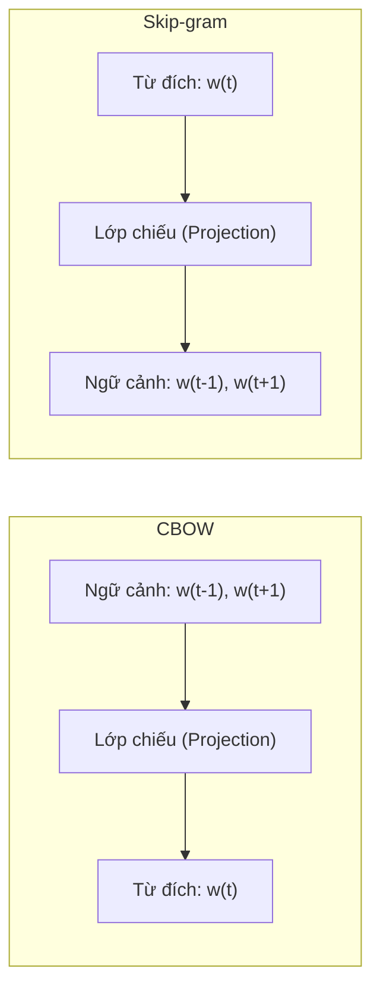
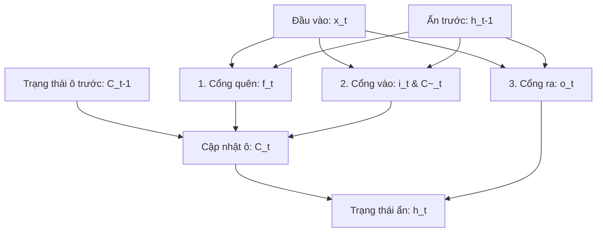
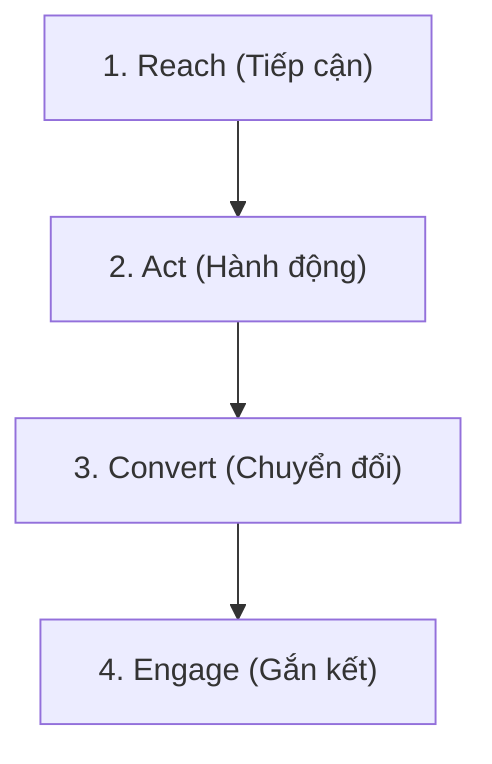

*Đầu trang (Header): Chương 2: Cơ sở lý thuyết và phương pháp công nghệ*
*Chân trang (Footer): Sinh viên thực hiện: Ksor Phuk*

# CHƯƠNG 2: CƠ SỞ LÝ THUYẾT VÀ PHƯƠNG PHÁP CÔNG NGHỆ

## 2.1. TỔNG QUAN VỀ KHAI PHÁ DỮ LIỆU VĂN BẢN VÀ NLP
Khai phá dữ liệu văn bản (Text Mining) là một nhánh nghiên cứu giao thoa giữa trí tuệ nhân tạo, học máy và quản trị cơ sở dữ liệu, tập trung vào quá trình tự động phát hiện, trích xuất các thông tin, tri thức hữu ích có tính chất phi hiển nhiên, mới mẻ và có thể hành động được (actionable insights) từ nguồn dữ liệu văn bản phi cấu trúc (unstructured text). Khác với dữ liệu quan hệ truyền thống được tổ chức chặt chẽ trong các bảng cơ sở dữ liệu với các kiểu dữ liệu định nghĩa rõ ràng, văn bản tự nhiên được viết bởi con người mang tính tự do, linh hoạt, chứa đựng nhiều biến thể ngữ nghĩa, sắc thái cảm xúc và độ nhiễu cực kỳ cao. Để khai phá hiệu quả nguồn tài nguyên này, các kỹ thuật Xử lý ngôn ngữ tự nhiên (NLP) đóng vai trò là cầu nối công nghệ cốt lõi, giúp máy tính có thể phân tích, biểu diễn và hiểu được ngôn ngữ tự nhiên của con người.

Đối với ngôn ngữ tiếng Việt trực tuyến (Vietnamese online text), các thách thức trong NLP được nhân lên gấp nhiều lần do các đặc trưng văn hóa xã hội và các đặc điểm ngôn ngữ học đặc thù của tiếng Việt kết hợp với hành vi sử dụng ngôn ngữ mạng:
- **Đặc trưng tách từ (Word Segmentation):** Khác với các ngôn ngữ phương Tây (như tiếng Anh, tiếng Pháp) vốn sử dụng khoảng trắng (space) làm ranh giới tự nhiên để phân tách các từ, tiếng Việt là ngôn ngữ đơn lập, âm tiết (syllable) rời rạc được phân tách bằng khoảng trắng nhưng từ mang nghĩa (từ đơn hoặc từ ghép) lại có thể gồm nhiều âm tiết ghép lại. Ví dụ: cụm từ "sản phẩm" gồm hai âm tiết độc lập "sản" và "phẩm", hay từ "giao hàng" gồm hai âm tiết "giao" và "hàng". Nếu không thực hiện tách từ chuẩn xác ở giai đoạn tiền xử lý, mô hình học máy sẽ coi đây là các token độc lập, làm mất đi hoàn toàn ngữ nghĩa gốc của từ ghép và dẫn đến sự sai lệch trong quá trình vector hóa.
- **Hiện tượng nhiễu từ vựng trực tuyến (Lexical Noise):** Người dùng trên các sàn TMĐT thường xuyên sử dụng ngôn ngữ teencode (vd: "đt" thay cho điện thoại, "ship" thay cho giao hàng, "rep" thay cho trả lời), lỗi chính tả cố ý để tăng biểu cảm, văn bản không dấu hoặc viết tắt không chuẩn mực. Sự đa dạng này tạo ra sự bùng nổ về mặt từ vựng (vocabulary explosion) và dẫn đến hiện tượng ma trận đặc trưng thưa (sparse feature matrices), làm suy giảm nghiêm trọng độ chính xác của các thuật toán phân loại nếu không được làm sạch tốt.
- **Biểu tượng cảm xúc (Emojis/Emoticons):** Emoji được sử dụng với mật độ cực kỳ cao trong các bình luận mua sắm để biểu thị trực quan thái độ hài lòng hay bực dọc. Tuy nhiên, các emoji này thường bị bỏ qua hoặc biểu diễn sai dưới dạng các ký tự lỗi (encoding errors). Việc tích hợp emoji và chuyển hóa chúng thành các cụm từ ngữ cảnh tương đương là bắt buộc để giữ lại sắc thái quan điểm của người dùng.
- **Tính đa nghĩa và ngữ cảnh phủ định phức tạp:** Tiếng Việt rất phong phú về ngữ cảnh và cách dùng từ phủ định (như "chẳng ngon lành gì", "không hề rẻ", "được cái giao nhanh còn lại tệ"). Việc phân tích ngữ nghĩa đòi hỏi mô hình phải có khả năng hiểu được mối quan hệ phụ thuộc giữa các từ cách xa nhau trong câu.

---

## 2.2. KỸ THUẬT VECTOR HÓA VĂN BẢN (TEXT EMBEDDING)
Để các mô hình toán học và thuật toán học máy có thể xử lý văn bản, thông tin ngôn ngữ dạng chuỗi ký tự phải được chuyển đổi thành các biểu diễn số học dưới dạng vector trong không gian nhiều chiều. Quá trình này được gọi là Vector hóa văn bản hoặc Nhúng từ (Word Embedding).

### 2.2.1. Mô hình TF-IDF
Mô hình TF-IDF (Term Frequency - Inverse Document Frequency) là một kỹ thuật thống kê truyền thống dùng để đánh giá tầm quan trọng của một từ đối với một tài liệu trong một tập hợp tài liệu (corpus). Trọng số TF-IDF tỷ lệ thuận với số lần từ xuất hiện trong tài liệu cụ thể và tỷ lệ nghịch với tần suất xuất hiện của từ đó trong toàn bộ ngữ liệu toàn cục, giúp loại bỏ ảnh hưởng của các stopwords xuất hiện phổ biến nhưng ít mang giá trị phân biệt lớp.

Giả sử ta có tập ngữ liệu $D$ gồm các tài liệu $d$, và từ $t$. Tần suất xuất hiện của từ $t$ trong tài liệu $d$ (TF) được tính bằng số lần xuất hiện thực tế $f_{t,d}$ chia cho tổng số lượng từ của tài liệu đó để tránh ảnh hưởng của độ dài văn bản:
$$TF(t, d) = \frac{f_{t,d}}{\sum_{t' \in d} f_{t', d}}$$

Tần suất tài liệu nghịch đảo (IDF) đo lường mức độ phổ biến của từ $t$ trên toàn bộ tập dữ liệu $D$, nhằm giảm trọng số của các từ xuất hiện ở quá nhiều tài liệu:
$$IDF(t, D) = \log\left(\frac{|D|}{1 + |\{d \in D : t \in d\}|}\right)$$
Trong đó $|D|$ là tổng số tài liệu trong tập dữ liệu, và mẫu số thể hiện số lượng tài liệu có chứa từ $t$. Việc cộng thêm 1 vào mẫu số đóng vai trò làm mịn (smoothing), ngăn chặn lỗi chia cho 0 khi từ $t$ không xuất hiện trong bất kỳ tài liệu nào của tập thử nghiệm.

Trọng số TF-IDF tích hợp của từ $t$ trong tài liệu $d$ được xác định bởi tích số:
$$TF\text{-}IDF(t, d, D) = TF(t, d) \times IDF(t, D)$$
Mặc dù TF-IDF rất hiệu quả cho các thuật toán học máy cổ điển nhờ tính toán nhanh và trực quan, hạn chế lớn nhất của nó là tạo ra các ma trận đặc trưng thưa có số chiều khổng lồ bằng kích thước từ điển, đồng thời hoàn toàn bỏ qua trật tự tuần tự của từ và mối quan hệ ngữ nghĩa đồng nghĩa (semantic similarity).

### 2.2.2. Mô hình Word2Vec
Word2Vec, được giới thiệu bởi Mikolov và các cộng sự tại Google (2013), là một phương pháp nhúng từ dựa trên mạng nơ-ron nông giúp ánh xạ mỗi từ trong từ điển thành một vector số thực phân phối liên tục trong không gian có số chiều thấp (thường từ 100 đến 300 chiều). Điểm ưu việt của Word2Vec là cấu trúc không gian hình học bảo toàn ngữ nghĩa: các từ có mối quan hệ ngữ cảnh gần gũi sẽ nằm gần nhau trong không gian vector (được đo bằng khoảng cách Cosine). Word2Vec hoạt động dựa trên hai kiến trúc chính:

*Hình 2.1: Sơ đồ so sánh hai kiến trúc CBOW và Skip-gram của Word2Vec*

#### 1. Kiến trúc CBOW (Continuous Bag-of-Words)
CBOW thực hiện dự đoán từ mục tiêu $w_t$ ở vị trí trung tâm dựa trên ngữ cảnh là các từ xung quanh trong phạm vi cửa sổ trượt kích thước $m$. Hàm mục tiêu của CBOW là cực đại hóa xác suất có điều kiện của từ đích khi biết các từ ngữ cảnh xung quanh:
$$J_{CBOW}(\theta) = -\sum_{t=1}^{T} \log P(w_t \mid w_{t-m}, \dots, w_{t-1}, w_{t+1}, \dots, w_{t+m})$$

#### 2. Kiến trúc Skip-gram
Trái ngược với CBOW, Skip-gram sử dụng từ đích $w_t$ để dự đoán các từ ngữ cảnh xung quanh nó trong phạm vi cửa sổ $m$. Kiến trúc này hoạt động hiệu quả hơn trên các tập dữ liệu lớn và giữ được ngữ nghĩa của các từ hiếm tốt hơn. Hàm tối ưu hóa của Skip-gram là cực đại hóa xác suất xuất hiện của các từ ngữ cảnh xung quanh từ đích:
$$J_{SG}(\theta) = -\frac{1}{T}\sum_{t=1}^{T}\sum_{-m \le j \le m, j \neq 0}\log P(w_{t+j} \mid w_t)$$

Trong cả hai kiến trúc, xác suất có điều kiện $P(w_O \mid w_I)$ của từ đầu ra $w_O$ khi biết từ đầu vào $w_I$ được định nghĩa bằng hàm Softmax toàn cục:
$$P(w_O \mid w_I) = \frac{\exp\left({v'_{w_O}}^T v_{w_I}\right)}{\sum_{w=1}^{W} \exp\left({v'_w}^T v_{w_I}\right)}$$
Trong đó $v_w$ và $v'_w$ lần lượt là biểu diễn vector đầu vào và đầu ra của từ $w$ trong từ điển kích thước $W$. Do mẫu số Softmax yêu cầu duyệt qua toàn bộ từ điển $W$ (chi phí tính toán $O(W)$ rất lớn khi từ điển chứa hàng triệu từ), Word2Vec sử dụng hai giải pháp thay thế hiệu quả là:
- **Phân tầng Softmax (Hierarchical Softmax):** Sử dụng cây nhị phân Huffman để biểu diễn từ điển, giảm độ phức tạp tính toán mẫu số từ $O(W)$ xuống $O(\log_2 W)$.
- **Lấy mẫu tiêu cực (Negative Sampling):** Thay thế việc tính toán Softmax toàn cục bằng một bài toán phân loại nhị phân (Logistic Regression) phân biệt từ ngữ cảnh thực tế với $k$ từ nhiễu được lấy ngẫu nhiên từ phân phối từ điển. Hàm mục tiêu tối ưu cho mỗi mẫu lúc này trở thành:
  $$E = \log \sigma({v'_{w_O}}^T v_{w_I}) + \sum_{i=1}^{k} \mathbb{E}_{w_i \sim P_n(w)} \left[ \log \sigma(-{v'_{w_i}}^T v_{w_I}) \right]$$
  Trong đó $\sigma(z) = 1/(1+e^{-z})$ là hàm sigmoid, và $P_n(w)$ là phân phối unigram lũy thừa $3/4$ để giảm tần suất lấy mẫu của các từ quá phổ biến.

---

## 2.3. CÁC MÔ HÌNH HỌC MÁY CƠ SỞ (BASELINE MACHINE LEARNING MODELS)
Các mô hình học máy truyền thống kết hợp trích xuất đặc trưng TF-IDF đóng vai trò là các đường cơ sở (baseline) quan trọng để so sánh hiệu năng với các kiến trúc học sâu và Transformer phức tạp.

### 2.3.1. Mô hình phân loại Naive Bayes
Naive Bayes là một thuật toán phân loại giám sát dựa trên định lý xác suất Bayes với giả thuyết "ngây thơ" (naive) về sự độc lập hoàn toàn giữa các đặc trưng đầu vào khi biết lớp mục tiêu. Dù giả thuyết này thường không phản ánh đúng thực tế ngữ pháp ngôn ngữ (nơi các từ liên kết chặt chẽ với nhau), Naive Bayes vẫn hoạt động cực kỳ hiệu quả và nhanh chóng cho tác vụ phân loại văn bản nhờ chi phí tính toán rất thấp.

Công thức xác suất Bayes xác định xác suất hậu nghiệm của lớp $C_k$ khi biết vector đặc trưng văn bản $x = (x_1, x_2, \dots, x_n)$:
$$P(C_k \mid x) = \frac{P(x \mid C_k)P(C_k)}{P(x)}$$

Áp dụng giả thuyết độc lập điều kiện của các từ đặc trưng $x_i$, xác suất đồng thời được phân rã thành tích các xác suất thành phần:
$$P(x \mid C_k) = \prod_{i=1}^{n} P(x_i \mid C_k)$$

Từ đó, bộ phân loại Naive Bayes lựa chọn lớp $\hat{y}$ có xác suất hậu nghiệm lớn nhất theo quy tắc quyết định MAP (Maximum A Posteriori):
$$\hat{y} = \arg\max_{k \in \{1, \dots, K\}} P(C_k) \prod_{i=1}^{n} P(x_i \mid C_k)$$
Xác suất tiên nghiệm $P(C_k)$ được tính bằng tỷ lệ số tài liệu thuộc lớp $C_k$ trên tổng số tài liệu train. Xác suất có điều kiện $P(x_i \mid C_k)$ được ước lượng trực tiếp từ tần suất xuất hiện của từ $x_i$ trong các tài liệu thuộc lớp $C_k$. Để giải quyết vấn đề từ chưa xuất hiện trong tập huấn luyện dẫn đến xác suất bằng 0 phá hủy toàn bộ phép nhân tích, kỹ thuật làm mịn Laplace (Laplace smoothing) được áp dụng:
$$P(x_i \mid C_k) = \frac{N_{k,i} + \alpha}{N_k + \alpha \cdot |V|}$$
Trong đó $N_{k,i}$ là số lần từ $x_i$ xuất hiện trong lớp $C_k$, $N_k$ là tổng số từ của lớp $C_k$, $|V|$ là kích thước từ điển huấn luyện, và $\alpha \ge 0$ là tham số làm mịn (thường chọn $\alpha = 1$).

### 2.3.2. Mô hình SVM (Support Vector Machine)
SVM là thuật toán phân loại giám sát hoạt động bằng cách tìm kiếm một siêu phẳng phân chia tối ưu hóa khoảng biên (margin) lớn nhất giữa các lớp dữ liệu trong không gian đặc trưng đa chiều. Siêu phẳng này được định nghĩa bởi phương trình pháp tuyến:
$$w^T x + b = 0$$
Trong đó $w$ là vector hệ số pháp tuyến xác định độ nghiêng của siêu phẳng và $b$ là hệ số tự do xác định vị trí lệch của siêu phẳng so với gốc tọa độ.

Đối với dữ liệu thực tế không phân chia tuyến tính hoàn hảo (linearly non-separable), thuật toán sử dụng biến bù sai số $\xi_i \ge 0$ (slack variables) để cho phép một mức độ lỗi chấp nhận được trên tập huấn luyện. Bài toán tối ưu hóa SVM dạng Primal với biên mềm (Soft Margin) có dạng:
$$\min_{w, b, \xi} \frac{1}{2} \|w\|^2 + C \sum_{i=1}^{N} \xi_i$$
$$\text{Thỏa mãn ràng buộc:} \quad y_i(w^T x_i + b) \ge 1 - \xi_i, \quad \xi_i \ge 0, \quad \forall i = 1, \dots, N$$
Trong đó $y_i \in \{-1, 1\}$ là nhãn lớp thực tế của mẫu $x_i$, và $C > 0$ là tham số điều hòa (regularization parameter) kiểm soát sự cân bằng giữa việc tối đa hóa khoảng biên siêu phẳng và cực tiểu hóa lỗi huấn luyện (vi phạm biên).

Để giải quyết bài toán này hiệu quả, người ta thường chuyển đổi sang bài toán đối ngẫu Lagrange (Dual formulation) thông qua các nhân tử Lagrange $\alpha_i$:
$$\max_{\alpha} \sum_{i=1}^{N} \alpha_i - \frac{1}{2} \sum_{i=1}^{N} \sum_{j=1}^{N} \alpha_i \alpha_j y_i y_j x_i^T x_j$$
$$\text{Thỏa mãn:} \quad \sum_{i=1}^{N} \alpha_i y_i = 0 \quad \text{và} \quad 0 \le \alpha_i \le C, \quad \forall i = 1, \dots, N$$
Sau khi giải được các nhân tử $\alpha_i$, vector hệ số pháp tuyến tối ưu được xác định bởi:
$$w = \sum_{i=1}^{N} \alpha_i y_i x_i$$
Chỉ các mẫu dữ liệu nằm sát biên có $\alpha_i > 0$ mới đóng vai trò định hình biên phân chia, các mẫu này được gọi là các Véc-tơ hỗ trợ (Support Vectors). Hàm quyết định dự báo cho mẫu mới $x$ được tính bằng:
$$f(x) = \text{sign}\left(\sum_{i=1}^{N} \alpha_i y_i (x_i^T x) + b\right)$$
Đối với bài toán phân loại văn bản sử dụng đặc trưng TF-IDF (không gian đặc trưng có số chiều cực lớn nhưng thưa), nhân tuyến tính (Linear Kernel) là lựa chọn tối ưu nhất về cả hiệu năng lẫn tốc độ xử lý do dữ liệu văn bản hầu như luôn phân chia tuyến tính được trong không gian số chiều lớn. Mẫu phân loại đa lớp trong SVM được thiết lập thông qua cơ chế One-vs-Rest (OvR), huấn luyện $K$ bộ phân loại nhị phân độc lập tương ứng với $K$ khía cạnh khác nhau.

---

## 2.4. MẠNG NƠ-RON HỒI QUY TUẦN TỰ SÂU (DEEP SEQUENCE MODELS)
Để khắc phục hạn chế mất mát thông tin tuần tự của mô hình túi từ, các kiến trúc mạng nơ-ron hồi quy được phát triển để mô hình hóa chuỗi văn bản bằng cách truyền trạng thái ẩn theo thời gian.

### 2.4.1. Mạng RNN
RNN xử lý chuỗi đầu vào $x = (x_1, x_2, \dots, x_T)$ bằng cách lặp lại việc tính toán trạng thái ẩn $h_t$ tại mỗi bước thời gian $t$, đóng vai trò như một bộ nhớ lưu trữ thông tin của các bước trước đó:
$$h_t = \tanh(W_{hh} h_{t-1} + W_{xh} x_t + b_h)$$
$$y_t = \text{softmax}(W_{hy} h_t + b_y)$$
Trong đó các ma trận trọng số $W_{hh}$, $W_{xh}$, $W_{hy}$ và vector chệch $b_h$, $b_y$ được chia sẻ chung qua tất cả các bước thời gian. Tuy nhiên, RNN gặp phải giới hạn nghiêm trọng về khả năng nhớ dài hạn do hiện tượng tiêu biến hoặc bùng nổ gradient trong quá trình lan truyền ngược qua thời gian (BPTT).

### 2.4.2. Mạng LSTM
Mạng LSTM, đề xuất bởi Hochreiter & Schmidhuber (1997), giải quyết triệt để điểm nghẽn tiêu biến đạo hàm của RNN bằng cách giới thiệu cấu trúc ô nhớ (cell state) được điều tiết bởi ba cổng logic hoạt động bằng hàm kích hoạt Sigmoid:

*Hình 2.2: Cấu trúc hoạt động bên trong của một ô nhớ LSTM*

Hệ phương trình toán học mô tả hoạt động của một ô nhớ LSTM tại thời điểm $t$ gồm:
1. **Cổng quên:** Quyết định lượng thông tin nào từ trạng thái ô trước đó $C_{t-1}$ sẽ bị loại bỏ:
   $$f_t = \sigma(W_f \cdot [h_{t-1}, x_t] + b_f)$$
2. **Cổng vào:** Quyết định lượng thông tin mới nào từ đầu vào sẽ được lưu trữ vào trạng thái ô:
   $$i_t = \sigma(W_i \cdot [h_{t-1}, x_t] + b_i)$$
   $$\tilde{C}_t = \tanh(W_c \cdot [h_{t-1}, x_t] + b_c)$$
3. **Cập nhật trạng thái ô (Cell State Update):** Tính toán trạng thái ô mới $C_t$:
   $$C_t = f_t \odot C_{t-1} + i_t \odot \tilde{C}_t$$
4. **Cổng ra:** Quyết định trạng thái ẩn đầu ra $h_t$ dựa trên trạng thái ô đã cập nhật:
   $$o_t = \sigma(W_o \cdot [h_{t-1}, x_t] + b_o)$$
   $$h_t = o_t \odot \tanh(C_t)$$
Trong đó $\sigma(z) = \frac{1}{1 + e^{-z}}$ là hàm kích hoạt Sigmoid, $\odot$ biểu thị phép nhân Hadamard (nhân từng phần tử) giữa các vector có cùng kích thước.

### 2.4.3. Mạng Bi-LSTM
Do LSTM thông thường chỉ duyệt văn bản theo một chiều từ trái qua phải, mô hình sẽ bỏ lỡ ngữ cảnh phía sau của từ. Kiến trúc Bi-LSTM khắc phục điều này bằng cách sử dụng song song hai mạng LSTM độc lập duyệt theo hai chiều ngược nhau:
- Mạng LSTM xuôi tính toán trạng thái ẩn xuôi $\overrightarrow{h}_t$ từ đầu chuỗi đến cuối chuỗi:
  $$\overrightarrow{h}_t = \text{LSTM}_{fw}(x_t, \overrightarrow{h}_{t-1})$$
- Mạng LSTM ngược tính toán trạng thái ẩn ngược $\overleftarrow{h}_t$ từ cuối chuỗi về đầu chuỗi:
  $$\overleftarrow{h}_t = \text{LSTM}_{bw}(x_t, \overleftarrow{h}_{t+1})$$
Vector biểu diễn cuối cùng của từ tại thời điểm $t$ là sự kết hợp (thường là nối chuỗi - concatenation) của hai trạng thái ẩn trên:
$$h_t = [\overrightarrow{h}_t \parallel \overleftarrow{h}_t]$$
Sự kết hợp này giúp Bi-LSTM có cái nhìn toàn diện về ngữ cảnh trước và sau của mỗi từ trong câu đánh giá.

---

## 2.5. KIẾN TRÚC TRANSFORMER VÀ MÔ HÌNH PHOBERT
Mặc dù Bi-LSTM hoạt động tốt hơn RNN, điểm yếu của nó vẫn là tính tuần tự không cho phép huấn luyện song song hóa hiệu quả trên GPU. Kiến trúc Transformer (Vaswani và cộng sự, 2017) đã thay thế hoàn toàn mạng hồi quy bằng cơ chế chú ý.

### 2.5.1. Cơ chế tự chú ý (Self-Attention)
Cơ chế tự chú ý cho phép mô hình gán các trọng số chú ý khác nhau giữa các từ trong câu, bất kể khoảng cách địa lý của chúng. Đối với một ma trận biểu diễn đầu vào $X$, ta tính toán ba ma trận Query ($Q$), Key ($K$) và Value ($V$) thông qua các ma trận trọng số tương ứng $W^Q$, $W^K$, $W^V$:
$$Q = X W^Q, \quad K = X W^K, \quad V = X W^V$$

Hàm tính toán trọng số chú ý (Scaled Dot-Product Attention) được định nghĩa như sau:
$$\text{Attention}(Q, K, V) = \text{softmax}\left(\frac{Q K^T}{\sqrt{d_k}}\right)V$$
Trong đó $d_k$ là kích thước của vector Key. Việc chia cho căn bậc hai của $d_k$ đóng vai trò điều hòa, giúp tránh việc hàm Softmax rơi vào các vùng có đạo hàm cực nhỏ khi giá trị tích vô hướng quá lớn.

Để nâng cao khả năng học các mối quan hệ ngữ nghĩa ở nhiều khía cạnh không gian khác nhau, cơ chế Chú ý đa đầu được áp dụng bằng cách chạy song song $h$ đầu tự chú ý độc lập:
$$\text{MultiHead}(Q, K, V) = \text{Concat}(\text{head}_1, \dots, head_h) W^O$$
$$\text{Trong đó:} \quad \text{head}_i = \text{Attention}(Q W_i^Q, K W_i^K, V W_i^V)$$

### 2.5.2. Mô hình BERT và tinh chỉnh RoBERTa
BERT là mô hình tiền huấn luyện sâu dựa trên các lớp mã hóa (Encoder) của Transformer. BERT sử dụng hai tác vụ huấn luyện không giám sát khổng lồ: MLM và NSP. 
RoBERTa là một phiên bản cải tiến tối ưu hóa BERT bằng cách loại bỏ tác vụ NSP, huấn luyện trên kích thước batch lớn hơn, dữ liệu nhiều hơn, và áp dụng cơ chế che từ động (dynamic masking), giúp nâng cao vượt bậc hiệu năng suy luận ngữ cảnh.

### 2.5.3. Mô hình PhoBERT cho ngôn ngữ tiếng Việt
PhoBERT (Nguyen & Tuan Nguyen, 2020) là mô hình ngôn ngữ pre-trained chuẩn mã nguồn mở đầu tiên được phát triển riêng biệt cho tiếng Việt dựa trên kiến trúc cải tiến RoBERTa. PhoBERT được huấn luyện trên tập dữ liệu tiếng Việt khổng lồ quy mô 20GB văn bản thô (gồm báo chí, văn bản hành chính và mạng xã hội) để tối ưu hóa khả năng hiểu văn phong tự nhiên.

- **Cơ chế token hóa âm tiết ghép bằng BPE (Byte Pair Encoding):** BPE là một thuật toán token hóa phân mảnh từ dưới lên (bottom-up), bắt đầu bằng việc khởi tạo từ điển từ tất cả các ký tự đơn lẻ trong tập dữ liệu. Qua từng vòng lặp, thuật toán sẽ đếm tần suất xuất hiện của các cặp ký tự hoặc chuỗi ký tự đứng cạnh nhau và tiến hành gộp cặp có tần suất lớn nhất thành một token mới trong từ điển:
  $$\text{vocab}_{k+1} = \text{vocab}_k \cup \{ (t_i, t_j) \}$$
  Quá trình này lặp lại cho đến khi từ điển đạt kích thước cấu hình trước (đối với PhoBERT là $64,000$ subwords). PhoBERT sử dụng công cụ tách từ chuyên dụng VnCoreNLP để nhóm các âm tiết tạo thành từ ghép tiếng Việt bằng dấu gạch dưới trước khi đưa vào bộ mã hóa BPE. Ví dụ, câu *"máy tính chạy rất mượt"* sẽ được tách từ thành *"máy_tính chạy rất mượt"*. Việc tách từ ghép này giúp BPE không chia cắt ngẫu nhiên các âm tiết trong từ ghép (như *"máy"* và *"tính"* thành hai phần riêng lẻ), bảo toàn cấu trúc ngữ pháp và từ vựng đặc trưng của tiếng Việt tốt hơn rất nhiều so với việc sử dụng các mô hình đa ngôn ngữ (như mBERT hay XLM-RoBERTa vốn chia nhỏ từ ghép tiếng Việt thành các phần âm tiết vô nghĩa). Ngoài ra, nhờ cơ chế BPE, bất kỳ từ mới nào nằm ngoài từ điển (OOV) đều có thể được phân rã thành các chuỗi con hoặc ký tự đơn lẻ đã biết, giải quyết triệt để lỗi OOV trong các mạng nơ-ron truyền thống.

- **Mục tiêu huấn luyện Masked Language Modeling (MLM):** PhoBERT được huấn luyện bằng cách che ngẫu nhiên 15% số lượng tokens đầu vào. Trong số các token bị che đó: 80% thời gian sẽ thay bằng token đặc biệt `<mask>`, 10% thay bằng một token ngẫu nhiên khác trong từ điển, và 10% giữ nguyên. Nhiệm vụ của mô hình là dự đoán token gốc bị che dựa trên ngữ cảnh hai chiều xung quanh. Hàm mất mát MLM được tính bằng entropy chéo âm trên các vị trí bị che:
  $$\mathcal{L}_{\text{MLM}} = -\sum_{i \in \mathcal{M}} \log P(x_i = y_i \mid X_{\backslash i})$$
  Trong đó $\mathcal{M}$ là tập hợp các vị trí token bị che, $y_i$ là token gốc tại vị trí $i$, và $X_{\backslash i}$ là toàn bộ chuỗi đầu vào ngoại trừ token tại vị trí $i$. Cơ chế học này giúp PhoBERT nắm bắt mối liên kết ngữ cảnh hai chiều (bidirectional context) cực kỳ sâu sắc giữa các từ.

- **Fine-tuning PhoBERT:** Lớp nhúng của token đặc biệt `<s>` (tương đương với token `[CLS]` của BERT) nằm ở vị trí đầu tiên của chuỗi đầu ra đại diện cho thông tin ngữ cảnh của toàn bộ câu. Trong các tác vụ phân loại, vector biểu diễn này được kết nối trực tiếp với các lớp kết nối đầy đủ (Dense Layers) để đưa ra dự báo.

---

## 2.6. LÝ THUYẾT VỀ ABSA
Trong khi phân tích cảm xúc thông thường định nghĩa bài toán dưới dạng ánh xạ một văn bản $d$ sang một nhãn cảm xúc đơn $s \in \{Positive, Negative, Neutral\}$, ABSA đi sâu hơn bằng cách phân rã thông tin thành một tập hợp các cặp giá trị:
$$\mathcal{O} = \{(a_1, s_1), (a_2, s_2), \dots, (a_m, s_m)\}$$
Trong đó $a_i$ là một khía cạnh cụ thể thuộc tập các khía cạnh mục tiêu $A$ (ví dụ: $A = \{Product, Price, Delivery, Service, App\}$), và $s_i$ là trạng thái cảm xúc tương ứng thuộc tập nhãn cảm xúc $S$.

ABSA thường được phân chia thành hai nhánh chính:
1. **Aspect Term Sentiment Analysis (ATSA):** Nhận diện các cụm từ thực thể cụ thể (aspect terms) xuất hiện trong câu (ví dụ: *"lẩu Thái"*, *"nhân viên phục vụ"*) và gán nhãn cảm xúc cho chúng.
2. **Aspect Category Sentiment Analysis (ACSA):** Phân loại văn bản vào các danh mục khía cạnh định sẵn (aspect categories - ví dụ: `Product`, `Service`) ngay cả khi khía cạnh đó không được đề cập trực tiếp bằng các từ ngữ tường minh (ví dụ: câu *"đợi mãi mới thấy"* không chứa chữ *"giao hàng"* nhưng thuộc khía cạnh `Delivery`). ACSA đặc biệt hữu ích cho các hệ thống Dashboard quản trị doanh nghiệp vì nó phân nhóm dữ liệu trực tiếp vào các phòng ban nghiệp vụ tương ứng để xử lý.

Đề tài này áp dụng phương pháp học máy đa nhiệm (Multi-task Learning) để đồng thời ước lượng phân phối xác suất chung của cả khía cạnh và cảm xúc trên tài liệu $d$:
$$P(A, S \mid d) = \prod_{j=1}^{K} P(a_j \mid d) \cdot P(s_j \mid a_j, d)$$
Trong đó $K = 5$ là số lượng khía cạnh, $P(a_j \mid d)$ là xác suất tài liệu đề cập đến khía cạnh $j$ (bài toán ACD), và $P(s_j \mid a_j, d)$ là xác suất trạng thái cảm xúc của khía cạnh đó (bài toán ATSC). Việc tối ưu hóa đồng thời giúp hai tác vụ bổ trợ lẫn nhau, nâng cao độ chính xác toàn cục.

Bài toán ABSA gồm hai nhiệm vụ chính:
1. **ACD:** Đây là bài toán phân loại đa nhãn xác định xem những khía cạnh nào trong tập $A$ được đề cập đến trong văn bản.
2. **ATSC:** Đây là bài toán phân loại đa lớp xác định trạng thái cảm xúc ($s \in S$) cho từng khía cạnh đã được nhận diện thành công.

Trong đề tài này, giải pháp **PhoBERT Multi-task Learning** được áp dụng để giải quyết đồng thời hai nhiệm vụ này trong cùng một kiến trúc thống nhất, giúp giảm độ trễ suy luận và tránh hiện tượng tích lũy sai số của các mô hình tuần tự.

---

## 2.7. KHUNG CHIẾN LƯỢC RACE
RACE là một mô hình khung chiến lược tiếp thị số được phát triển bởi Smart Insights, giúp doanh nghiệp lập kế hoạch, quản lý và tối ưu hóa các hoạt động truyền thông và kinh doanh trực tuyến theo vòng đời khách hàng.

*Hình 2.3: Vòng đời khách hàng theo khung chiến lược tiếp thị số RACE*

- **Reach (Tiếp cận):** Thu hút khách hàng tiềm năng đến với cửa hàng trực tuyến thông qua việc tăng nhận diện thương hiệu và tiếp cận đa kênh. Trong TMĐT, điểm đánh giá cao và các eWOM tích cực đóng vai trò tối quan trọng để thu hút lượt truy cập tự nhiên.
- **Act (Hành động):** Khuyến khích khách hàng tương tác với thương hiệu, tìm hiểu sản phẩm và thêm sản phẩm vào giỏ hàng. Việc trích xuất và hiển thị các điểm nổi bật của sản phẩm bằng hệ thống ABSA giúp khách hàng nhanh chóng đưa ra quyết định tương tác.
- **Convert (Chuyển đổi):** Chuyển hóa người truy cập thành người mua hàng thực tế (tạo doanh thu). Bằng cách phân tích sâu các rào cản ở khía cạnh Giá cả (`Price`) hoặc lỗi Ứng dụng (`App`), doanh nghiệp có thể loại bỏ ngay các điểm nghẽn kỹ thuật hoặc chính sách giá để tối ưu hóa tỷ lệ chuyển đổi.
- **Engage (Gắn kết):** Xây dựng mối quan hệ lâu dài để biến người mua hàng lần đầu thành khách hàng trung thành, thúc đẩy họ để lại các đánh giá tích cực (eWOM tốt). Đây là nơi hệ thống ABSA phát huy vai trò cảnh báo sớm: khi xuất hiện các phàn nàn tiêu cực về Dịch vụ (`Service`) hoặc Giao hàng (`Delivery`) có số lượt đồng tình (`thumbsupcount`) tăng cao, hệ thống lập tức phát tín hiệu để nhân sự can thiệp chăm sóc khách hàng, ngăn chặn sự rời đi và xử lý khủng hoảng truyền thông kịp thời.

---
*Đầu trang (Header): Chương 2: Cơ sở lý thuyết và phương pháp công nghệ*
*Chân trang (Footer): Sinh viên thực hiện: Ksor Phuk*
