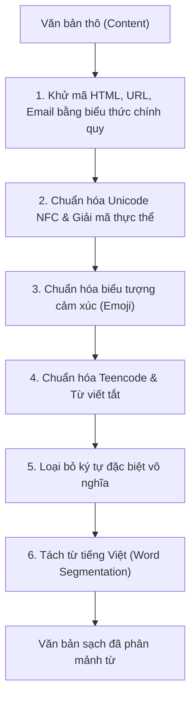
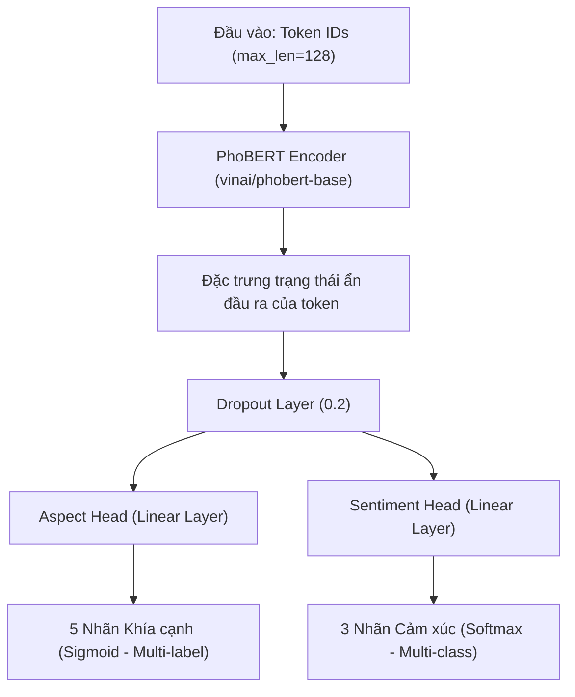

*Đầu trang (Header): Chương 3: Thiết kế thực nghiệm và xây dựng mô hình*
*Chân trang (Footer): Sinh viên thực hiện: Ksor Phuk*

# CHƯƠNG 3: THIẾT KẾ THỰC NGHIỆM VÀ XÂY DỰNG MÔ HÌNH

## 3.1. DỮ LIỆU THỰC NGHIỆM
### 3.1.1. Nguồn gốc và quy mô tập dữ liệu
Nghiên cứu sử dụng tập dữ liệu công khai trên nền tảng Kaggle mang tên `vietnamese-ecommerce-review` do tác giả HienBM thu thập và chia sẻ. Đây là tập dữ liệu thu thập các phản hồi và đánh giá thực tế của người mua hàng tại hệ thống bán lẻ trực tuyến UEL Store (khách hàng tham gia chủ yếu là sinh viên trường Đại học Kinh tế - Luật, Đại học Quốc gia TP.HCM). Tập dữ liệu cung cấp quy mô lớn với hơn 1.3 triệu dòng đánh giá thô phản ánh chính xác ngôn ngữ tự nhiên trên không gian mạng xã hội và thương mại điện tử Việt Nam.

Để phục vụ cho quá trình huấn luyện và đánh giá thực nghiệm mô hình một cách khách quan, dữ liệu được phân chia theo hai cấu trúc chính:
- **Tập dữ liệu huấn luyện (70% dữ liệu gốc):** Chứa 909.913 đánh giá hợp lệ sau khi lọc bỏ các bản ghi trùng lặp hoặc trống nội dung. Tập dữ liệu này được sử dụng để huấn luyện mô hình máy học và tinh chỉnh Transformer.
- **Tập dữ liệu dự báo (30% dữ liệu gốc):** Gồm 389.964 đánh giá, được sử dụng để chạy suy luận quy mô lớn, nhằm thu thập các dữ liệu định lượng phục vụ cho việc biểu diễn trên Dashboard và phân ### 3.1.2. Cấu trúc các trường dữ liệu
Tập dữ liệu thô bao gồm các thuộc tính thông tin đa chiều sau, được cấu trúc hóa để hỗ trợ cả tác vụ xử lý ngôn ngữ và phân tích nghiệp vụ:
1. `reviewid` (String): Mã định danh duy nhất cho từng đánh giá của khách hàng, đóng vai trò khóa chính (Primary Key) phục vụ việc liên kết cơ sở dữ liệu.
2. `username` (String): Tên tài khoản của người mua hàng, hỗ trợ phân tích hành vi người dùng, phát hiện các hành vi spam hoặc tài khoản bot ảo cố ý đánh giá tiêu cực phá hoại thương hiệu.
3. `content` (Text): Nội dung đánh giá dạng văn bản thô của khách hàng. Đây là trường thông tin đầu vào cốt lõi để đưa vào đường ống tiền xử lý và mô hình học máy.
4. `score` (Integer): Số sao đánh giá từ 1 đến 5 sao của người mua, phản ánh mức độ hài lòng tổng quan của khách hàng.
5. `thumbsupcount` (Integer): Số lượt người dùng khác bấm bình chọn đánh giá này là hữu ích (Helpful count). Biến này thể hiện mức độ lan truyền và ảnh hưởng xã hội (social proof) của đánh giá đối với cộng đồng mua sắm trực tuyến.
6. `replycontent` (Text): Nội dung phản hồi của người bán đối với đánh giá của khách hàng, phản ánh hiệu quả, thái độ và tốc độ của quy trình chăm sóc khách hàng.

### 3.1.3. Phân bổ dữ liệu và hiện tượng mất cân bằng lớp
Trong thực tiễn khai phá dữ liệu thương mại điện tử, hiện tượng mất cân bằng lớp (class imbalance) là một thách thức kinh điển và cực kỳ nghiêm trọng. Để chứng minh tính thực tế và độ khó của tác vụ nghiên cứu, đề tài đã thống kê chi tiết sự phân bổ các khía cạnh (Aspects) chéo với các trạng thái cảm xúc (Sentiments) trên tập đánh giá chuẩn (Gold Evaluation). Bảng 3.1 dưới đây thể hiện sự phân bổ này:

**Bảng 3.1: Phân bổ số lượng mẫu theo khía cạnh và cảm xúc trên tập Gold Eval**
*Nguồn: Thống kê thực nghiệm từ tập dữ liệu chuẩn hóa của đề tài*

| Khía cạnh (Aspect) | Tích cực (Positive) | Trung tính (Neutral) | Tiêu cực (Negative) | Tổng cộng (Support) | Tỷ lệ % |
| :--- | :---: | :---: | :---: | :---: | :--- |
| **Product** *(Sản phẩm)* | 260 | 38 | 50 | 348 | 48.27% |
| **Price** *(Giá cả)* | 75 | 15 | 10 | 100 | 13.87% |
| **Delivery** *(Giao hàng)* | 110 | 12 | 24 | 146 | 20.25% |
| **Service** *(Dịch vụ)* | 35 | 10 | 22 | 67 | 9.29% |
| **App** *(Ứng dụng)* | 130 | 18 | 35 | 183 | 25.38% |

*Lưu ý: Do một câu đánh giá có thể đề cập đến nhiều khía cạnh khác nhau đồng thời (bài toán phân loại đa nhãn), tổng số lượng nhãn xuất hiện (844 nhãn) sẽ lớn hơn tổng số câu đánh giá thực tế (721 câu).*

Dựa trên số liệu thống kê tại Bảng 3.1, ta có thể rút ra một số nhận xét khoa học quan trọng về đặc trưng phân bổ dữ liệu:
1. **Sự vượt trội của khía cạnh Product:** Khía cạnh Sản phẩm chiếm tỷ trọng lớn nhất với 48.27% số mẫu, phản ánh đúng hành vi tự nhiên của người tiêu dùng khi mối quan tâm cốt lõi của họ luôn là chất lượng, công dụng, và hình thức của sản phẩm vật lý nhận được.
2. **Sự lệch lớp cảm xúc Tích cực:** Ở hầu hết các khía cạnh, nhãn cảm xúc Tích cực (Positive) chiếm đa số tuyệt đối (khoảng 70% - 75%). Đây là đặc tính phân phối tự nhiên trên các sàn thương mại điện tử trực tuyến, khi đa số người mua có xu hướng để lại phản hồi tốt nếu không gặp phải sự cố quá lớn. Sự mất cân bằng này đòi hỏi mô hình học sâu và học máy phải áp dụng các kỹ thuật phạt lỗi có trọng số (weighted loss) để tránh việc mô hình thiên vị hoàn toàn về lớp đa số.
3. **Độ hiếm của khía cạnh Service:** Khía cạnh Dịch vụ chăm sóc khách hàng chỉ chiếm 9.29% số mẫu trong tập đánh giá. Do số lượng mẫu rất hạn chế, đây là khía cạnh thử thách lớn nhất cho cả ba mô hình trong việc tối ưu hóa độ chính xác và tránh hiện tượng bỏ sót thông tin (low recall).
4. **Nhãn Trung tính (Neutral) - ranh giới mơ hồ:** Nhãn Trung tính chiếm tỷ lệ rất thấp và thường là những đánh giá trung lập hoặc mang tính chất so sánh, mô tả sự thật khách quan (ví dụ: *"giá bình thường, giao hàng 3 ngày"*). Đây là lớp rất khó phân loại vì ranh giới ngữ nghĩa giữa nó với Tích cực hoặc Tiêu cực là không rõ ràng.

---

## 3.2. ĐƯỜNG ỐNG TIỀN XỬ LÝ DỮ LIỆU (NLP PIPELINE)
Để giải quyết độ nhiễu cao của ngôn ngữ mạng, một đường ống NLP Pipeline được thiết kế và lập trình trong mô-đun tiền xử lý dữ liệu. Quy trình bao gồm các bước tuần tự được thể hiện trong Hình 4:

*Hình 3.1: Chi tiết quy trình NLP Pipeline làm sạch văn bản*

### 3.2.1. Loại bỏ các thẻ HTML, URL và Email
Các đánh giá TMĐT thô thường chứa các thẻ định dạng HTML do quá trình cào dữ liệu, hoặc các đường link quảng cáo, email rác của các gian hàng đối thủ. Regex được áp dụng để loại bỏ các yếu tố này:
- Thẻ HTML: `HTML_TAG_RE = re.compile(r"<[^>]+>")`
- Siêu liên kết URL: `URL_RE = re.compile(r"https?://\S+|www\.\S+", re.IGNORECASE)`
- Địa chỉ Email: `EMAIL_RE = re.compile(r"\b[\w.+-]+@[\w-]+(?:\.[\w-]+)+\b", re.IGNORECASE)`

### 3.2.2. Chuẩn hóa mã hóa Unicode
Văn bản tiếng Việt trực tuyến hay gặp lỗi gõ chữ dẫn đến việc cùng một ký tự nhưng tồn tại dưới hai dạng: Unicode tổ hợp (composed) hoặc Unicode dựng sẵn (decomposed). Ví dụ, chữ "hòa" có thể lưu dưới dạng mã dựng sẵn (h-ò-a) hoặc mã tổ hợp (h-o-a-dấu huyền). Hàm `normalize_unicode` sử dụng thư viện `unicodedata` để chuyển tất cả về dạng dựng sẵn chuẩn **NFC**, đồng thời giải mã các thực thể HTML (HTML entity unescaping) qua hàm `html.unescape()` để khôi phục các ký tự đặc biệt bị mã hóa dạng xml/html entity:
$$\text{Text}_{NFC} = \text{unicodedata.normalize}(\text{'NFC'}, \text{html.unescape}(\text{Text}))$$

### 3.2.3. Chuẩn hóa biểu tượng cảm xúc (Emoji)
Các biểu tượng cảm xúc chứa trọng số cảm xúc cực kỳ lớn trong đánh giá TMĐT. Thay vì loại bỏ chúng như các pipeline NLP tiếng Anh thông thường, mô-đun tiền xử lý sử dụng hai bảng từ điển ánh xạ `TEXT_EMOJI_MAP` và `UNICODE_EMOJI_MAP` để dịch các biểu tượng này sang ngôn ngữ văn bản tiếng Việt tương đương. Việc này giúp giữ lại 100% ngữ cảnh biểu cảm và dịch chúng thành các từ khóa ngữ nghĩa rõ ràng cho mô hình học máy (ví dụ: `👍` -> `hài lòng` thay vì giữ nguyên dạng ký tự unicode lạ gây nhiễu).

**Bảng 3.2: Danh sách ánh xạ chuẩn hóa biểu tượng cảm xúc tiêu biểu**
*Nguồn: Xây dựng thực nghiệm từ từ điển tiền xử lý của đề tài*

| Loại biểu cảm | Ký hiệu (Emoji / Emoticon) | Văn bản chuẩn hóa tương ứng | Tác động ngữ nghĩa |
| :--- | :--- | :--- | :--- |
| **Ký tự emoji vui** | `":)"`, `":D"`, `":>-)"` | `" vui_vẻ "` | Biểu đạt sự hài lòng, tích cực |
| **Ký tự buồn** | `":("`, `":-("` | `" buồn "` | Biểu đạt sự không ưng ý, thất vọng |
| **Biểu tượng trái tim** | `"<3"`, `"❤️"`, `"😍"` | `" yêu_thích "` | Thể hiện mức độ yêu thích cực kỳ cao |
| **Biểu tượng đồng tình** | `"👍"`, `"nice"`, `"ok"` | `" hài_lòng "` | Xác nhận dịch vụ/sản phẩm tốt |
| **Biểu tượng tức giận** | `"😡"`, `"😠"` | `" tức_giận "` | Cảnh báo thái độ tiêu cực nghiêm trọng |
| **Biểu tượng khóc/tiếc** | `"😭"`, `"😢"` | `" buồn "` | Khách hàng gặp sự cố hỏng hóc hoặc giao chậm |
| **Biểu tượng không đồng tình** | `"👎"` | `" không_hài_lòng "` | Đánh giá chất lượng dịch vụ kém |

### 3.2.4. Chuẩn hóa teencode và từ viết tắt
Xây dựng một từ điển ánh xạ `DEFAULT_ABBREVIATIONS` gồm các từ viết tắt phổ biến trên sàn TMĐT Việt Nam để chuẩn hóa cấu trúc câu. Quá trình ánh xạ được thực hiện bằng cách sắp xếp các từ khóa theo độ dài giảm dần để tránh việc ghi đè sai các từ con (ví dụ: thay thế từ ghép "san pham" trước khi thay thế từ đơn "sp"), sau đó sử dụng biểu thức chính quy biên từ (`(?<!\w)key(?!\w)`) để thay thế chính xác, ngăn ngừa việc thay thế nhầm các từ có chứa ký tự viết tắt đó (ví dụ: không thay thế từ "không" thành "khônghông" khi gặp chữ "k").

**Bảng 3.3: Bảng ánh xạ teencode và thuật ngữ viết tắt trong thương mại điện tử**
*Nguồn: Từ điển từ viết tắt tích hợp trong module tiền xử lý*

| Từ viết tắt / Teencode | Thuật ngữ gốc tiếng Việt | Ý nghĩa chuẩn hóa tương ứng |
| :--- | :--- | :--- |
| `"sp"`, `"san pham"` | Sản phẩm | `"sản phẩm"` |
| `"nv"`, `"nviên"` | Nhân viên | `"nhân viên"` |
| `"đc"`, `"dc"` | Được | `"được"` |
| `"k"`, `"ko"`, `"khong"`, `"hok"`, `"hông"` | Không | `"không"` |
| `"ship"`, `"shipper"` | Ship / Giao vận | `"giao hàng"` |
| `"cskh"` | Chăm sóc khách hàng | `"chăm sóc khách hàng"` |
| `"kh"`, `"khach"` | Khách hàng | `"khách hàng"` |
| `"shop"`, `"cua hang"` | Shop / Cửa hàng | `"cửa hàng"` |
| `"rep"`, `"tl"`, `"tra loi"` | Reply / Trả lời | `"trả lời"` |
| `"ib"`, `"inbox"` | Inbox / Nhắn tin | `"nhắn tin"` |
| `"feedback"`, `"fb"` | Feedback / Phản hồi | `"phản hồi"` |
| `"gđ"` | Giai đoạn | `"giai đoạn"` |

### 3.2.5. Loại bỏ ký tự đặc biệt vô nghĩa
Sử dụng biểu thức chính quy `[^\w\s%]+` để loại bỏ các ký tự đặc biệt như dấu chấm câu, dấu chấm hỏi lặp lại, dấu ngoặc... nhưng giữ lại ký tự phần trăm `%` (thường xuất hiện trong các mô tả thuộc tính sản phẩm như cotton 100%, sale 50%). Cuối cùng, hàm `normalize_spaces` loại bỏ các khoảng trắng thừa để đưa văn bản về định dạng chuẩn hóa thống nhất.

### 3.2.6. Phân mảnh từ tiếng Việt (Word Segmentation)
Nhằm nối các âm tiết tạo thành từ ghép tiếng Việt bằng ký tự gạch dưới `_`, module tích hợp bộ công cụ phân mảnh từ `WordSegmenter`:
- **Chế độ tự động/VnCoreNLP:** Sử dụng wrapper `py-vncorenlp` để gọi mô hình Java VnCoreNLP với các annotators `["wseg", "pos"]` thực hiện tách từ và gán nhãn từ loại chính xác cao. Thuật toán của VnCoreNLP sử dụng mô hình học máy dựa trên phân tích phụ thuộc chuyển trạng thái (transition-based dependency parsing) để dự đoán ranh giới từ và gán nhãn từ loại đồng thời, cho phép đạt độ chính xác tách từ trên 97%.
- **Chế độ Fallback:** Khi môi trường không có Java hoặc tệp mô hình VnCoreNLP (ví dụ trên môi trường Docker tối giản), hệ thống tự động chuyển sang chế độ fallback bằng cách duyệt danh sách các thuật ngữ dự án `DEFAULT_MULTIWORD_TERMS` (như *"sản phẩm"*, *"giao hàng"*, *"đóng gói"*, *"nhân viên"*, *"dịch vụ"*) và chuyển đổi chúng thành dạng nối gạch dưới (ví dụ: `"sản_phẩm"`, `"giao_hàng"`, `"đóng_gói"`).

Việc phân mảnh từ là bước chuẩn bị sống còn đối với mô hình ngôn ngữ PhoBERT. Vì PhoBERT được tiền huấn luyện trên kho ngữ liệu tiếng Việt đã được tách từ sẵn ở cấp độ âm tiết ghép (syllable-level segmented), nếu ta đưa văn bản thô không tách từ vào bộ tokenizer BPE (Byte Pair Encoding) của PhoBERT, mô hình sẽ phân rã từ ghép thành các token âm tiết rời rạc (ví dụ: `"sản"`, `"phẩm"`), làm mất đi cấu trúc ngữ nghĩa liền mạch và suy giảm nghiêm trọng chất lượng vector nhúng đầu ra.

---

## 3.3. THIẾT LẬP VÀ HUẤN LUYỆN CÁC MÔ HÌNH ABSA
Đề tài tiến hành thiết lập thực nghiệm song song trên ba kiến trúc thuật toán có độ phức tạp tăng dần:

### 3.3.1. Mô hình Baseline: TF-IDF + Linear SVM
Đầu vào văn bản được vector hóa bằng phương pháp TF-IDF thông qua bộ trích xuất đặc trưng `make_vectorizer` với số lượng từ vựng tối đa là $20,000$ (`max_features=20000`). Để nắm bắt ngữ cảnh tốt hơn, đề tài cấu hình dải n-gram từ 1 đến 2 (`ngram_range=(1, 2)`), giúp giữ lại các cụm hai từ ghép cặp phổ biến (ví dụ: *"giao_nhanh"*, *"không_tốt"*).
Do bài toán ACD là bài toán phân loại đa nhãn, mô hình sử dụng cấu trúc phân loại độc lập cho từng nhãn thông qua wrapper `OneVsRestClassifier` của thư viện Scikit-Learn.
- **Thuật toán cốt lõi:** `LinearSVC` (Linear Support Vector Classifier) với cấu hình `class_weight='balanced'` để tự động điều chỉnh trọng số biên phân chia tỷ lệ nghịch với tần suất lớp trong tập train, giải quyết tình trạng lệch lớp dữ liệu.
- **Các siêu tham số:** Hệ số điều hòa $C = 1.0$, hàm lỗi `loss='hinge'`, sai số dừng hội tụ `tol=1e-4`, số vòng lặp tối đa `max_iter=1000`.
- **Quy trình pipeline:**
  $$\text{Văn bản thô} \xrightarrow{\text{TF-IDF}} \mathbf{X}_{\text{sparse}} \xrightarrow{\text{OneVsRest(LinearSVC)}} \mathbf{y}_{\text{aspects}} \in \{0, 1\}^5$$

### 3.3.2. Mô hình Deep Learning: Bi-LSTM + Word2Vec + POS Embeddings
Thiết lập mạng nơ-ron hồi quy tuần tự sâu bằng framework PyTorch. Đặc trưng từ vựng được biểu diễn kết hợp bởi hai không gian nhúng song song nhằm bổ trợ thông tin cú pháp cho ngữ nghĩa từ vựng:
1. **Lớp nhúng từ:** Ánh xạ chỉ số từ vựng sang vector liên tục chiều rộng $embedding\_dim=128$, khởi tạo ngẫu nhiên và cho phép tinh chỉnh trọng số (fine-tune) trong quá trình huấn luyện.
2. **Lớp nhúng POS:** Gán nhãn từ loại (POS) phỏng đoán cho từng token (thông qua hàm `guess_pos_tags` xác định các thẻ từ loại cơ bản như danh từ `NOUN`, động từ `VERB`, tính từ `ADJ`, trạng từ `ADV`, và các từ loại khác `WORD`) và ánh xạ sang vector chiều rộng $pos\_embedding\_dim=32$.

Vector biểu diễn tổng hợp của từ là phép nối hai không gian nhúng:
$$\mathbf{e}_t = [\mathbf{e}_t^{\text{word}} \parallel \mathbf{e}_t^{\text{pos}}] \in \mathbb{R}^{160}$$

Chuỗi vector $\mathbf{e} = (\mathbf{e}_1, \dots, \mathbf{e}_T)$ được đưa qua mạng hồi quy hai chiều Bi-LSTM. Tại đây, quá trình tính toán trạng thái ẩn được thực hiện song song theo hai chiều thời gian độc lập:

1. **Chiều xuôi (Forward LSTM):** Duyệt từ đầu câu đến cuối câu ($t = 1 \to T$). Tại mỗi bước thời gian $t$, trạng thái ẩn xuôi $\overrightarrow{\mathbf{h}}_t \in \mathbb{R}^{128}$ được tính toán qua hệ phương trình cổng:
   $$\overrightarrow{\mathbf{f}}_t = \sigma(\mathbf{W}_{xf} \mathbf{e}_t + \mathbf{W}_{hf} \overrightarrow{\mathbf{h}}_{t-1} + \mathbf{b}_f)$$
   $$\overrightarrow{\mathbf{i}}_t = \sigma(\mathbf{W}_{xi} \mathbf{e}_t + \mathbf{W}_{hi} \overrightarrow{\mathbf{h}}_{t-1} + \mathbf{b}_i)$$
   $$\overrightarrow{\tilde{\mathbf{C}}}_t = \tanh(\mathbf{W}_{xc} \mathbf{e}_t + \mathbf{W}_{hc} \overrightarrow{\mathbf{h}}_{t-1} + \mathbf{b}_c)$$
   $$\overrightarrow{\mathbf{C}}_t = \overrightarrow{\mathbf{f}}_t \odot \overrightarrow{\mathbf{C}}_{t-1} + \overrightarrow{\mathbf{i}}_t \odot \overrightarrow{\tilde{\mathbf{C}}}_t$$
   $$\overrightarrow{\mathbf{o}}_t = \sigma(\mathbf{W}_{xo} \mathbf{e}_t + \mathbf{W}_{ho} \overrightarrow{\mathbf{h}}_{t-1} + \mathbf{b}_o)$$
   $$\overrightarrow{\mathbf{h}}_t = \overrightarrow{\mathbf{o}}_t \odot \tanh(\overrightarrow{\mathbf{C}}_t)$$

2. **Chiều ngược (Backward LSTM):** Duyệt từ cuối câu ngược về đầu câu ($t = T \to 1$). Tại mỗi bước thời gian $t$, trạng thái ẩn ngược $\overleftarrow{\mathbf{h}}_t \in \mathbb{R}^{128}$ được tính toán qua hệ phương trình cổng tương ứng:
   $$\overleftarrow{\mathbf{f}}_t = \sigma(\mathbf{V}_{xf} \mathbf{e}_t + \mathbf{V}_{hf} \overleftarrow{\mathbf{h}}_{t+1} + \mathbf{c}_f)$$
   $$\overleftarrow{\mathbf{i}}_t = \sigma(\mathbf{V}_{xi} \mathbf{e}_t + \mathbf{V}_{hi} \overleftarrow{\mathbf{h}}_{t+1} + \mathbf{c}_i)$$
   $$\overleftarrow{\tilde{\mathbf{C}}}_t = \tanh(\mathbf{V}_{xc} \mathbf{e}_t + \mathbf{V}_{hc} \overleftarrow{\mathbf{h}}_{t+1} + \mathbf{c}_c)$$
   $$\overleftarrow{\mathbf{C}}_t = \overleftarrow{\mathbf{f}}_t \odot \overleftarrow{\mathbf{C}}_{t+1} + \overleftarrow{\mathbf{i}}_t \odot \overleftarrow{\tilde{\mathbf{C}}}_t$$
   $$\overleftarrow{\mathbf{o}}_t = \sigma(\mathbf{V}_{xo} \mathbf{e}_t + \mathbf{V}_{ho} \overleftarrow{\mathbf{h}}_{t+1} + \mathbf{c}_o)$$
   $$\overleftarrow{\mathbf{h}}_t = \overleftarrow{\mathbf{o}}_t \odot \tanh(\overleftarrow{\mathbf{C}}_t)$$

Trong đó, các ma trận $\mathbf{W}$ và $\mathbf{V}$ là các trọng số cần huấn luyện, $\mathbf{b}$ và $\mathbf{c}$ là các vector bias, $\sigma$ là hàm kích hoạt Sigmoid, và $\odot$ đại diện cho phép nhân Hadamard (nhân từng phần tử). Vector biểu diễn cuối cùng của từ tại thời điểm $t$ là sự kết hợp (nối chuỗi - concatenation) của hai trạng thái ẩn xuôi và ẩn ngược:
$$\mathbf{h}_t = [\overrightarrow{\mathbf{h}}_t \parallel \overleftarrow{\mathbf{h}}_t] \in \mathbb{R}^{256}$$

Để xử lý hiệu quả các chuỗi văn bản có độ dài khác nhau trong cùng một batch huấn luyện, hệ thống áp dụng kỹ thuật đóng gói chuỗi động (`pack_padded_sequence` và `pad_packed_sequence` của PyTorch). Đầu tiên, các câu đánh giá được sắp xếp theo thứ tự độ dài giảm dần, sau đó đóng gói lại để bỏ qua việc tính toán đạo hàm trên các token đệm lót (`<pad>`). Sau khi đi qua mạng Bi-LSTM, chuỗi được giải nén trở lại kích thước cũ trước khi thực hiện Attention Pooling.

Sử dụng cơ chế lấy trung bình có trọng số che (attention mask pooling) để gộp thông tin trên toàn bộ câu đánh giá, loại trừ hoàn toàn ảnh hưởng của các vị trí đệm lót (`<pad>`) dùng để đưa các câu về cùng một độ dài cố định:
$$\mathbf{p} = \frac{\sum_{t=1}^{T} \mathbf{h}_t \cdot m_t}{\sum_{t=1}^{T} m_t}$$
Trong đó $m_t \in \{0, 1\}$ là mặt nạ chú ý (attention mask). Đầu ra $\mathbf{p}$ được đưa qua lớp Dropout ($0.2$) để tránh hiện tượng quá khớp, sau đó đi qua lớp tuyến tính kết nối đầy đủ (Linear Classifier Layer) để đưa ra dự đoán xác suất khía cạnh.
- **Tham số huấn luyện:** Số epoch = 10, Batch size = 32, Tốc độ học khởi tạo (Learning Rate) = 1e-3, sử dụng bộ lập lịch suy giảm tốc độ học theo Cosine Annealing, Hàm tối ưu hóa = Adam.
- **Hàm mất mát:** Sử dụng hàm mất mát BCEWithLogitsLoss kết hợp trọng số lớp dương `pos_weight` tính động từ dữ liệu train để phạt nặng lỗi dự đoán sai các khía cạnh thiểu số:
    $$\mathcal{L}_{\text{BCE\_weighted}} = -\frac{1}{N}\sum_{i=1}^{N}\sum_{j=1}^{5} \left[ w_j y_{i,j} \log \sigma(x_{i,j}) + (1 - y_{i,j}) \log (1 - \sigma(x_{i,j})) \right]$$
    Trong đó $w_j = \frac{N - N_j^{+}}{N_j^{+}}$ là tỷ lệ giữa số mẫu âm và số mẫu dương của khía cạnh thứ $j$, giúp cân bằng lại sự ảnh hưởng của các lớp ít dữ liệu trong quá trình cập nhật đạo hàm.

### 3.3.3. Mô hình Transformer: PhoBERT Multi-task Learning
Đây là mô hình cải tiến sâu sắc nhất của đề tài, tích hợp giải pháp học máy đa nhiệm để đồng thời giải quyết ACD và ATSC trong duy nhất một lần truyền thẳng (forward pass) qua mạng.

*Hình 3.2: Kiến trúc mô hình đa nhiệm PhoBERT Multi-task*

- **Kiến trúc mạng:** Mô hình sử dụng mạng mã hóa `vinai/phobert-base` làm backbone chính. Vector trạng thái ẩn tại vị trí đầu tiên của token đặc biệt `<s>` (CLS token) đại diện cho ngữ cảnh toàn câu $\mathbf{h}_{\text{cls}} \in \mathbb{R}^{768}$ được đưa qua lớp Dropout. Sau đó, nó được chia làm hai nhánh đầu ra song song:
  - Nhánh khía cạnh (`Aspect Head`): Lớp tuyến tính ánh xạ từ 768 chiều sang 5 chiều (tương đương với 5 khía cạnh). Sử dụng hàm mất mát BCE với logits:
    $$\mathcal{L}_{\text{aspect}} = \text{BCEWithLogitsLoss}(\mathbf{z}_{\text{aspect}}, \mathbf{y}_{\text{aspect}}; \mathbf{w}_{\text{aspect\_pos}})$$
  - Nhánh cảm xúc (`Sentiment Head`): Lớp tuyến tính ánh xạ từ 768 chiều sang 3 chiều (tương ứng với 3 cảm xúc tiêu cực, trung tính, tích cực). Sử dụng hàm mất mát entropy chéo:
    $$\mathcal{L}_{\text{sentiment}} = \text{CrossEntropyLoss}(\mathbf{z}_{\text{sentiment}}, \mathbf{y}_{\text{sentiment}}; \mathbf{w}_{\text{sentiment\_class}})$$
- **Tổng hàm mất mát của mô hình đa nhiệm:** Đề tài sử dụng tổng trực tiếp hai hàm mất mát với trọng số bằng nhau ($\lambda_1 = \lambda_2 = 1$), cho phép mô hình tối ưu hóa đồng thời cả khả năng nhận diện khía cạnh và dự báo cảm xúc:
  $$\mathcal{L}_{\text{total}} = \lambda_1 \mathcal{L}_{\text{aspect}} + \lambda_2 \mathcal{L}_{\text{sentiment}}$$
- **Giải pháp tăng tốc huấn luyện Pre-tokenization:** Một trong những đóng góp thực nghiệm quan trọng của đề tài là thiết kế lớp `PhoBertDataset` thực hiện quá trình mã hóa phân mảnh từ (Tokenization) toàn bộ ngữ liệu train và eval ở chế độ batch lớn trên CPU từ trước khi nạp vào vòng lặp huấn luyện, sau đó lưu trữ kết quả đã mã hóa dưới dạng file nhị phân tuần tự hóa (serialized pickle). Trong quá trình huấn luyện, DataLoader chỉ việc đọc trực tiếp dữ liệu tensor đã số hóa từ RAM/SSD thay vì chạy tokenization thời gian thực. Điều này loại bỏ hoàn toàn hiện tượng nghẽn cổ chai I/O trên CPU do phải chạy tokenizer lặp đi lặp lại qua mỗi epoch, duy trì hiệu suất GPU T4 x2 ở mức tải 98%-100% liên tục.
- **Kỹ thuật tự động co giãn độ phân giải FP16 Mixed Precision:** Đề tài áp dụng kỹ thuật huấn luyện với độ chính xác hỗn hợp FP16 thông qua module `torch.cuda.amp` (`autocast` và `GradScaler`). Kỹ thuật này giúp lưu trữ các trọng số và kích hoạt dưới dạng 16-bit float thay vì 32-bit truyền thống tại các lớp tính toán tuyến tính, giảm đáng kể băng thông bộ nhớ và tăng tốc độ tính toán của các lõi Tensor Cores trên GPU, trong khi vẫn duy trì độ chính xác nhờ việc tự động co giãn thang đo đạo hàm (gradient scaling) để tránh hiện tượng tiêu biến số học (underflow). Kỹ thuật này giúp giảm thời gian chạy suy luận quy mô lớn cho 389,964 đánh giá xuống chỉ còn chưa đầy **7 phút**.
- **Tham số tinh chỉnh mô hình:** Số Epoch = 3, Batch size = 4 (tối ưu hóa bộ nhớ GPU), Hàm tối ưu hóa = AdamW, Tốc độ học cực đại $lr=2\times 10^{-5}$, Hệ số suy giảm trọng số (weight decay) = 0.01. Sử dụng bộ lập lịch tốc độ học có pha khởi động tuyến tính (Linear Warmup) chiếm 10% tổng số bước huấn luyện đầu tiên để ổn định trọng số, sau đó giảm dần tuyến tính về 0. Độ dài chuỗi tối đa được cấu hình $max\_len=128$.

---
*Đầu trang (Header): Chương 3: Thiết kế thực nghiệm và xây dựng mô hình*
*Chân trang (Footer): Sinh viên thực hiện: Ksor Phuk*
