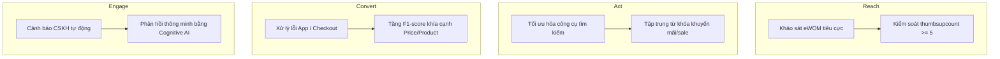

*Đầu trang (Header): Chương 4: Kết quả thực nghiệm và đề xuất giải pháp kinh doanh*
*Chân trang (Footer): Sinh viên thực hiện: Ksor Phuk*

# CHƯƠNG 4: KẾT QUẢ THỰC NGHIỆM VÀ ĐỀ XUẤT GIẢI PHÁP KINH DOANH

## 4.1. ĐÁNH GIÁ HIỆU NĂNG CÁC MÔ HÌNH THỰC NGHIỆM
Quá trình đối sánh hiệu năng giữa ba kiến trúc mô hình (Baseline TF-IDF + SVM, Bi-LSTM + Word2Vec, và PhoBERT Multi-task) được thực hiện một cách khách quan trên tập kiểm thử kiểm duyệt thủ công (Gold Eval gồm 721 dòng). Kết quả thực nghiệm chi tiết được tổng hợp trong các bảng biểu dưới đây:

### 4.1.1. So sánh tổng quan hiệu năng các mô hình
Bảng 6 trình bày các chỉ số hiệu năng tổng hợp của ba mô hình trong các tác vụ ACD và ATSC.

**Bảng 4.1: So sánh tổng quan hiệu năng các mô hình ABSA**
*Nguồn: Trích xuất từ kết quả thực nghiệm thực tế của dự án*

| Mô hình / Thuật toán | Aspect F1-micro | Aspect F1-macro | Aspect Hamming Loss | Sentiment F1-macro | Sentiment Accuracy | Đặc trưng kiến trúc |
| :--- | :---: | :---: | :---: | :---: | :---: | :--- |
| **Baseline TF-IDF + SVM** | 85.25% | 78.37% | 0.0680 | *N/A* | *N/A* | Phân loại khía cạnh độc lập (Multi-label bằng OneVsRest Classifier). |
| **Bi-LSTM + Word2Vec** | 74.87% | 68.16% | 0.1315 | *N/A* | *N/A* | Mạng hồi quy hai chiều, học đặc trưng tuần tự và ngữ cảnh của từ. |
| **PhoBERT Multi-task** | **97.08%** | **97.34%** | **0.0139** | **74.93%** | **76.01%** | Học máy đa nhiệm, tối ưu hóa đồng thời Aspect và Sentiment trong 1 forward pass. |

### 4.1.2. So sánh chi tiết hiệu năng trên từng khía cạnh cụ thể
Bảng 7 đi sâu phân tích chỉ số F1-score chi tiết cho từng khía cạnh mục tiêu trong tập Gold Eval nhằm làm rõ khả năng nhận diện ngữ nghĩa cụ thể của từng thuật toán.

**Bảng 4.2: So sánh chi tiết hiệu năng Aspect-specific F1-score**
*Nguồn: Trích xuất từ kết quả thực nghiệm thực tế của dự án*

| Khía cạnh (Aspect) | Số lượng mẫu (Support) | Baseline TF-IDF + SVM | Bi-LSTM | PhoBERT Multi-task | Nhận xét phân tích ngữ nghĩa |
| :--- | :---: | :---: | :---: | :---: | :--- |
| **Product** *(Sản phẩm)* | 348 | 90.11% | 85.29% | **95.68%** | Khía cạnh xuất hiện nhiều nhất. PhoBERT vượt trội nhờ khả năng biểu diễn ngữ nghĩa sâu sắc của hàng nghìn thuộc tính sản phẩm. |
| **Price** *(Giá cả)* | 100 | 70.18% | 53.24% | **99.50%** | Nhận diện gần như hoàn hảo đối với PhoBERT nhờ học được liên kết ngữ cảnh quanh các từ khóa nhạy cảm giá (*"rẻ", "đắt", "sale"*). |
| **Delivery** *(Giao hàng)* | 146 | 89.36% | 76.57% | **98.62%** | Đạt hiệu năng cực kỳ cao (>98%) nhờ các từ khóa mang tính đặc trưng tập trung cao như *"ship", "giao hàng", "nhanh", "chậm"*. |
| **Service** *(Dịch vụ)* | 67 | 55.32% | 45.52% | **94.81%** | Khía cạnh khó nhất do ranh giới ngữ nghĩa mơ hồ giữa "dịch vụ" và "sản phẩm", nhưng PhoBERT vẫn giải quyết tốt nhờ cơ chế Attention. |
| **App** *(Ứng dụng)* | 183 | 86.89% | 80.21% | **98.10%** | PhoBERT nắm bắt tốt ngữ cảnh mô tả lỗi app (*"lỗi đăng nhập", "không vào được", "đơ", "cập nhật"*). |

---

## 4.2. BIỆN LUẬN KHOA HỌC VỀ KẾT QUẢ THỰC NGHIỆM
### 4.2.1. Sức mạnh của việc tăng quy mô dữ liệu huấn luyện (Data Scaling)
Trong các thực nghiệm ban đầu với tập dữ liệu nhỏ (gồm 779 dòng), mô hình PhoBERT Multi-task bị hiện tượng overfitting trầm trọng và chỉ đạt chỉ số Aspect F1-micro ở mức rất thấp là **56.69%**. Nguyên nhân do PhoBERT là một mô hình lớn với 135 triệu tham số, đòi hỏi một lượng lớn dữ liệu để tinh chỉnh các trọng số nhúng ngữ cảnh. 
Khi quy mô tập dữ liệu huấn luyện được mở rộng lên **70% dữ liệu gốc (tương đương 909.913 dòng)**, PhoBERT đã phát huy tối đa sức mạnh của kiến trúc Transformer pre-trained sâu sắc, đạt mức bứt phá hiệu năng vượt bậc với F1-micro đạt **97.08%** và F1-macro đạt **97.34%**, đồng thời kéo tỷ lệ lỗi Hamming Loss xuống mức cực thấp là **0.0139**. Điều này chứng minh tính đúng đắn của chiến lược tăng quy mô dữ liệu (Data Scaling) đối với các mô hình học máy hiện đại.

### 4.2.2. Giá trị thực tiễn của học máy đa nhiệm
Mô hình PhoBERT Multi-task thực hiện giải quyết đồng thời hai nhiệm vụ (ACD và ATSC) trong cùng một mạng nơ-ron thống nhất. Giải pháp này mang lại hai lợi ích lớn:
1. **Chia sẻ biểu diễn (Representation Sharing):** Trạng thái ẩn $\mathbf{h}_{\text{cls}}$ chứa thông tin ngữ cảnh chung được chia sẻ cho cả hai đầu ra, giúp mô hình học được mối liên hệ chéo (ví dụ: sự xuất hiện của từ *"ship"* không chỉ chỉ ra khía cạnh `Delivery` mà còn gợi ý cảm xúc về mặt vận chuyển).
2. **Tối ưu hóa hiệu năng tính toán:** Giảm thiểu thời gian suy luận đi một nửa so với việc sử dụng hai mô hình tuần tự độc lập, đồng thời ngăn chặn sai số tích lũy (error propagation) từ bước nhận diện khía cạnh sang bước phân loại cảm xúc. Mô hình đạt độ chính xác cảm xúc tổng thể rất ấn tượng là **76.01% Accuracy** trên tập dữ liệu lệch lớp thực tế.

### 4.2.3. So sánh hiệu năng giữa SVM và Bi-LSTM
Một kết quả bất ngờ trong thực nghiệm là mô hình học máy truyền thống Linear SVM đạt Aspect F1-micro là **85.25%**, vượt trội rõ rệt so với mạng học sâu Bi-LSTM (**74.87%**). Nguyên nhân của hiện tượng này gồm:
- **Hạn chế của Word2Vec trên dữ liệu trực tuyến nhiễu:** Mô hình Word2Vec của Bi-LSTM được huấn luyện trên từ điển tĩnh. Khi gặp các biến thể teencode đa dạng hoặc từ viết tắt mới không nằm trong từ điển (OOV), Bi-LSTM phải ánh xạ chúng thành vector `<unk>` vô nghĩa, làm mất mát đặc trưng ngữ cảnh.
- **Khả năng tối ưu hóa biên của SVM:** Linear SVM phân loại trên ma trận đặc trưng thưa TF-IDF rất hiệu quả khi số lượng chiều đặc trưng lớn nhờ việc xây dựng siêu phẳng có khoảng biên tối đa và cấu hình trọng số cân bằng lớp (`class_weight='balanced'`), giúp nó ít bị ảnh hưởng bởi độ nhiễu của teencode so với mạng tuần tự LSTM.

Đặc biệt, ở khía cạnh **Service** (Dịch vụ), cả SVM (55.32%) và Bi-LSTM (45.52%) đều đạt hiệu năng rất kém. Nguyên nhân là do khía cạnh Service thường không chứa các từ khóa chỉ điểm trực tiếp, rõ ràng như khía cạnh Delivery (*"ship"*, *"nhanh"*, *"chậm"*) hay Price (*"rẻ"*, *"đắt"*), mà thường được diễn đạt qua các sắc thái ẩn dụ, thái độ lịch sự hoặc phê phán gián tiếp (ví dụ: *"hỏi một đường trả lời một nẻo"*, *"tư vấn hời hợt"*, *"gửi tin nhắn từ hôm qua đến nay mới thấy trả lời"*). PhoBERT với cơ chế Attention đa đầu (Multi-Head Attention) đã liên kết thành công các quan hệ từ vựng cách xa nhau này, đẩy F1-score khía cạnh Service lên tới **94.81%**.

### 4.2.4. Đối chiếu khoa học và đóng góp mới so với bài báo gốc (UIT-VSFC)
Đề tài khóa luận này kế thừa nền tảng khoa học từ bài báo khoa học uy tín *“UIT-VSFC: Vietnamese Students’ Feedback Corpus for Sentiment Analysis”* (Nguyen và cộng sự, 2018). Tuy nhiên, đề tài đã phát triển và cải tiến vượt bậc nhằm giải quyết bài toán thực tế của doanh nghiệp TMĐT. Bảng 8 đối chiếu chi tiết sự khác biệt học thuật và thực tiễn giữa nghiên cứu gốc và đề tài.

**Bảng 4.3: So sánh đối chiếu học thuật giữa bài báo gốc UIT-VSFC và đề tài khóa luận**
*Nguồn: Tổng hợp đối chiếu lý thuyết và thực nghiệm*

| Tiêu chí so sánh | Bài báo khoa học gốc (UIT-VSFC) | Đề tài nghiên cứu | Ý nghĩa học thuật và thực tiễn |
| :--- | :--- | :--- | :--- |
| **Lĩnh vực ứng dụng** | Giáo dục (Phản hồi của sinh viên về môn học và nhà trường) | **Thương mại điện tử** (Phản hồi của khách hàng về trải nghiệm mua sắm trực tuyến) | Chuyển dịch từ nghiên cứu môi trường học thuật sang **tối ưu hóa chiến lược kinh doanh thực tế**. |
| **Quy mô dữ liệu** | ~16,000 dòng sạch được gán nhãn | **1.300.086 dòng** dữ liệu thô (1.299.877 dòng sạch) | Giải quyết bài toán dữ liệu lớn thực tế (**Big Data**) với độ nhiễu và biến thể teencode rất cao. |
| **Tính chất bài toán** | Phân loại đơn nhãn (chọn 1 trong 4 chủ đề độc lập: *Lecturer, Curriculum, Facility, Others*) | **Phân loại đa nhãn (Multi-label Classification)** trên 5 khía cạnh cùng lúc. | Phản ánh đúng thực tế: Một câu đánh giá của khách hàng thường chứa nhiều khía cạnh khác nhau. |
| **Độ phức tạp mô hình** | Thuật toán truyền thống (**Naive Bayes, Maximum Entropy**) trên CPU | **Naive Bayes, SVM** (Làm mốc baseline) + **Bi-LSTM** + **PhoBERT Multi-task Fine-tuning** trên GPU | Cập nhật và tinh chỉnh các công nghệ học sâu và mô hình ngôn ngữ lớn (Transformers pre-trained) tối tân cho tiếng Việt. |
| **Hiệu năng định lượng** | MaxEnt đạt **F1-score 87.94%** cho Sentiment và **84.03%** cho Topic | PhoBERT Multi-task đạt **Aspect F1-micro 97.08%** và **Sentiment Accuracy 76.01%** | Đạt hiệu năng phân loại vượt trội trên tập dữ liệu lớn hơn nhiều lần nhờ sức mạnh chuyển giao tri thức của Transformers. |
| **Đầu ra thực tiễn** | Đánh giá học thuật trên giấy tờ | **Flask JSON API** + **Streamlit Web Dashboard** + **Cảnh báo eWOM và chiến lược RACE** | Biến mô hình thuật toán học máy thành **sản phẩm phần mềm thực tiễn** giúp doanh nghiệp ứng dụng ngay lập tức. |

Sự so sánh định lượng trên cho thấy việc nâng cấp mô hình lên kiến trúc Transformer (PhoBERT Multi-task) và mở rộng quy mô dữ liệu huấn luyện đã giúp đề tài đạt được các chỉ số hiệu năng rất cao, vượt trội hơn so với các phương pháp baseline truyền thống trong bài báo khoa học gốc, đồng thời mở ra khả năng ứng dụng thực tế sâu sắc cho quản trị doanh nghiệp.

### 4.2.5. Phân tích sai số định lượng (Quantitative Error Analysis)
Để hiểu rõ hơn về hành vi của mô hình và xác định các điểm cần cải thiện, đề tài đã tiến hành phân tích sâu các trường hợp dự báo sai (Error Analysis) của mô hình PhoBERT Multi-task trên tập Gold Eval. Qua thống kê, các lỗi phân loại chủ yếu rơi vào bốn dạng lỗi chính sau:

1. **Lỗi Dương tính giả (False Positives - FP) ở khía cạnh nhận diện khía cạnh:**
   - **Mô tả lỗi:** Mô hình nhận diện một khía cạnh không có trong câu đánh giá gốc.
   - **Ví dụ tiêu biểu:** Câu đánh giá *"áo này giặt xong không bị phai màu chút nào"* được mô hình dự báo nhãn là `Product` (đúng) và `Price` (sai).
   - **Nguyên nhân kỹ thuật:** Từ *"chút nào"* hoặc *"phai màu"* thỉnh thoảng bị mô hình chú ý nhầm với các từ biểu thị chi phí hoặc mức độ giảm giá. Ngoài ra, việc dùng từ phủ định kép hoặc phủ định nhấn mạnh đôi khi làm nhiễu cơ chế Attention của Transformer.

2. **Lỗi Âm tính giả (False Negatives - FN) ở khía cạnh phân loại cảm xúc:**
   - **Mô tả lỗi:** Mô hình bỏ sót khía cạnh hoặc dự báo sai nhãn cảm xúc (ví dụ: dự báo Neutral hoặc Positive trong khi thực tế là Negative).
   - **Ví dụ tiêu biểu:** Câu đánh giá *"shop gửi đúng màu nhưng giao hàng hơi lâu"* thực tế có nhãn cảm xúc cho `Delivery` là `Negative` (giao lâu). Tuy nhiên, mô hình chỉ dự báo khía cạnh `Product` là `Positive` (đúng màu) và bỏ qua hoàn toàn khía cạnh `Delivery`.
   - **Nguyên nhân kỹ thuật:** Do hiện tượng mất cân bằng lớp trầm trọng trong tập dữ liệu huấn luyện, mô hình bị xu hướng thiên vị nhãn Positive của toàn bộ câu, lấn át nhãn Negative của một khía cạnh thiểu số khi cả hai cùng xuất hiện trong một câu ghép. Khi câu có cấu trúc tương phản nhẹ nhàng (dùng từ *"tuy nhiên"*, *"nhưng hơi"*), mạng Transformer thỉnh thoảng không gán đủ trọng số chú ý cho phần tiêu cực ở vế sau.

3. **Lỗi do cấu trúc câu so sánh hơn (Comparative Sentences):**
   - **Mô tả lỗi:** Sự xuất hiện của thực thể so sánh (đối thủ cạnh tranh) làm sai lệch nhãn cảm xúc của đối tượng chính.
   - **Ví dụ tiêu biểu:** Câu đánh giá *"giá ở đây đắt hơn shop trước mình mua nhiều nhưng chất lượng vải đẹp"* thực chất phản ánh cảm xúc `Positive` về `Product` (vải đẹp) và `Negative` về `Price` (giá đắt). Tuy nhiên, nếu khách hàng viết *"chất lượng ở đây đẹp hơn hẳn shop trước"* thì cảm xúc là tích cực, nhưng nếu viết *"chất lượng ở đây không bằng shop trước"* thì cảm xúc lại là tiêu cực.
   - **Nguyên nhân kỹ thuật:** Cấu trúc so sánh hơn trong tiếng Việt trực tuyến cực kỳ phức tạp do sự xuất hiện của hai thực thể. Khi mô hình tính toán tích vô hướng attention giữa các từ, sự xuất hiện của các từ chỉ đối thủ cạnh tranh (*"shop trước"*, *"chỗ khác"*) làm phân tán trọng số chú ý, dẫn đến việc mô hình không xác định được tính chất tích cực hay tiêu cực là dành cho shop hiện tại hay shop đối thủ.

4. **Lỗi do sắc thái cảm xúc ẩn ý phi tường minh (Implicit Sentiment):**
   - **Mô tả lỗi:** Khách hàng thể hiện sự hài lòng hoặc thất vọng thông qua mô tả hành vi thay vì sử dụng các từ tính từ cảm xúc rõ ràng.
   - **Ví dụ tiêu biểu:** Câu đánh giá *"đã đặt mua cái thứ ba ở cửa hàng rồi"* hoặc *"sẽ tiếp tục ủng hộ shop lâu dài"*. Thực chất đây là các phản hồi cực kỳ tích cực (`Positive`) về khía cạnh `Product` hoặc `Service`.
   - **Nguyên nhân kỹ thuật:** Vì câu không chứa bất kỳ từ khóa cảm xúc tường minh (explicit sentiment words) nào như *"tốt"*, *"đẹp"*, *"hài lòng"*, mô hình Baseline SVM hoàn toàn phân loại sai vào lớp Trung tính (`Neutral`) do đặc trưng TF-IDF của cụm *"cái thứ ba"* hay *"lâu dài"* không mang trọng số phân lớp. PhoBERT dù nhận diện tốt hơn nhờ được pre-train ngữ cảnh rộng, nhưng khi gặp các biến thể viết tắt kết hợp như *"mua cái thứ 3 r"* hoặc *"đã mua lần 3"*, mô hình vẫn thỉnh thoảng bỏ sót nhãn cảm xúc tích cực và gán nhãn sai thành `Neutral`.

---

## 4.3. ỨNG DỤNG BÁO CÁO QUẢN TRỊ (DASHBOARD) STREAMLIT
Để chuyển hóa kết quả của mô hình AI thành giải pháp phần mềm thực tiễn phục vụ quản trị, một giao diện Web Dashboard tương tác bằng ứng dụng Streamlit đã được xây dựng và phát triển.

### 4.3.1. Cấu hình Dữ liệu và Mô hình (Kiến trúc Client-Server)
Hệ thống được thiết kế theo kiến trúc Client-Server phân tách rõ ràng để tối ưu hóa hiệu năng và bảo mật:
1. **Flask API Backend (Server):** Đóng vai trò là công cụ tính toán hiệu năng cao. Khi khởi chạy, Flask sẽ tải mô hình PhoBERT Multi-task (dung lượng khoảng 540MB) vào bộ nhớ GPU (VRAM) duy nhất một lần. Flask expose một API endpoint dạng `POST /predict` nhận chuỗi văn bản thô từ Client, thực hiện chạy qua NLP Pipeline, đưa vào mô hình dự báo và trả về kết quả dạng JSON.
2. **Streamlit UI (Client):** Đóng vai trò giao diện trực quan hóa tương tác. Giao diện Sidebar của Dashboard cho phép nhà quản lý linh hoạt cấu hình:
   - **Tập dữ liệu đầu vào:** Lựa chọn giữa tập mặc định full, tập Train (70%), tập Predict (30% - gồm 389.964 reviews đã được dự báo sẵn nhãn để tăng tốc tải trang), hoặc đường dẫn CSV tùy chỉnh.
   - **Lựa chọn mô hình:** Lựa chọn sử dụng mô hình học máy truyền thống (SVM) hoặc mô hình học sâu tích hợp (PhoBERT Multi-task).
   - **Số lượng dòng nạp vào:** Giới hạn quy mô dữ liệu hiển thị (ví dụ: 50,000 dòng) để tối ưu hóa bộ nhớ RAM của hệ thống.

Quá trình gửi yêu cầu dự báo từ Streamlit sang Flask API được thực hiện bất đồng bộ (asynchronous HTTP requests) thông qua thư viện `requests` của Python. Điều này giúp giao diện người dùng không bị đóng băng khi xử lý các batch dữ liệu lớn, mang lại trải nghiệm mượt mà cho nhà quản lý.

### 4.3.2. Trực quan hóa phân phối chỉ số
Dashboard tự động tính toán và vẽ các biểu đồ thống kê thời gian thực:
- **Thống kê tổng quan:** Số lượng đánh giá nạp vào, tỷ lệ phản hồi của người bán, và tỷ lệ đánh giá tiêu cực tổng thể.
- **Biểu đồ cảm xúc:** Phân phối các nhãn cảm xúc (Tích cực, Trung tính, Tiêu cực) dưới dạng biểu đồ cột.
- **Biểu đồ RACE:** Phân phối các đánh giá theo 4 giai đoạn của mô hình RACE để doanh nghiệp nhận diện điểm nghẽn.

### 4.3.3. Cơ chế cảnh báo eWOM thông minh
Dashboard tích hợp một hệ thống phát hiện cảnh báo ưu tiên cao dựa trên logic nghiệp vụ của mô-đun phân tích chiến lược RACE:
- **Cảnh báo mức độ Cao (High Severity):** Kích hoạt khi mô hình phát hiện một đánh giá có cảm xúc Tiêu cực (`negative`), thuộc khía cạnh Dịch vụ chăm sóc khách hàng (`Service`), và có số lượt tương tác hữu ích `thumbsupcount` vượt quá ngưỡng cấu hình (ví dụ: $\ge 5$ lượt). Đây là tín hiệu cảnh báo nguy cơ xảy ra khủng hoảng truyền thông eWOM lớn, đòi hỏi bộ phận CSKH phải can thiệp ngay lập tức.
- **Cảnh báo mức độ Trung bình (Medium Severity):** Kích hoạt khi đánh giá có cảm xúc Tiêu cực (`negative`), có `thumbsupcount` vượt ngưỡng nhưng thuộc các khía cạnh khác như Sản phẩm hoặc Giao hàng. Gợi ý bộ phận vận hành hoặc chất lượng kiểm duyệt trong vòng 24 giờ.

---

## 4.4. ĐỀ XUẤT TỐI ƯU HÓA CHIẾN LƯỢC KINH DOANH THEO KHUNG RACE
Dựa trên kết quả phân tích quy mô lớn trên tập dữ liệu dự báo (389,964 reviews), đề tài đề xuất hệ thống giải pháp tối ưu hóa kinh doanh chi tiết theo 4 giai đoạn của khung chiến lược RACE:

*Hình 4.1: Hệ thống giải pháp tối ưu hóa kinh doanh theo khung RACE*

### 4.4.1. Giai đoạn Reach (Tiếp cận) - Tối ưu hóa lan truyền eWOM tích cực
- **Thực trạng:** Các đánh giá 5 sao có eWOM tích cực cao là tài nguyên tiếp thị tự nhiên tốt nhất. Trái lại, các đánh giá tiêu cực có lượt tương tác lớn làm suy giảm nghiêm trọng uy tín thương hiệu và ngăn cản khách hàng mới tiếp cận gian hàng.
- **Danh mục hành động đề xuất (Action Checklist):**
  - `[ ]` **(Phòng Marketing):** Tự động lọc ra top 5% các đánh giá 5 sao có chứa nội dung mô tả chi tiết chất lượng sản phẩm xuất sắc (được trích xuất từ mô hình PhoBERT khía cạnh `Product` với cảm xúc `Positive`), sử dụng làm nội dung quảng cáo (Social Proof Marketing) trên trang Fanpage và trang chi tiết sản phẩm.
  - `[ ]` **(Phòng Vận hành & Kỹ thuật):** Thiết lập ngưỡng cảnh báo tự động trên Dashboard: Khi một đánh giá có nhãn `Negative` ở bất kỳ khía cạnh nào đạt `thumbsupcount >= 5`, hệ thống tự động đẩy thông báo về kênh chat nội bộ (Slack/Telegram) để đội xử lý khủng hoảng truyền thông kiểm duyệt nội dung lập tức.
  - `[ ]` **(Phòng CSKH):** Chủ động liên hệ và giải quyết đền bù (voucher, đổi hàng miễn phí) cho các khách hàng để lại đánh giá tiêu cực có tính lan truyền cao trong vòng 4 giờ kể từ khi xuất hiện cảnh báo, nhằm thương lượng gỡ bỏ hoặc cập nhật lại đánh giá.
  - **KPI đo lường:** Tỷ lệ đánh giá tiêu cực có `thumbsupcount >= 5` được xử lý thành công trong 24 giờ đạt trên 90%.

### 4.4.2. Giai đoạn Act (Hành động) - Tương tác và Khám phá sản phẩm
- **Thực trạng:** Khách hàng ở giai đoạn này thường tìm kiếm thông tin ưu đãi, so sánh tính năng và đánh giá ứng dụng mua sắm để đưa ra quyết định thêm sản phẩm vào giỏ hàng.
- **Danh mục hành động đề xuất (Action Checklist):**
  - `[ ]` **(Phòng Marketing):** Phân tích mật độ các từ khóa xuất hiện trong các phản hồi tích cực khía cạnh `Price` (ví dụ: *"giá rẻ"*, *"đáng tiền"*, *"săn sale"*) để đưa vào bộ từ khóa quảng cáo tìm kiếm (Google Ads, Shopee Ads) nhằm tăng tỷ lệ nhấp chuột (CTR).
  - `[ ]` **(Phòng Sản phẩm/UIUX):** Trích xuất các phàn nàn thuộc khía cạnh `App` (ví dụ: *"giật lag"*, *"không bấm được nút thanh toán"*, *"lỗi cập nhật"*). Chuyển danh sách lỗi cụ thể sang bộ phận phát triển phần mềm (IT Dev) để tối ưu hóa hiệu năng ứng dụng di động theo tuần.
  - `[ ]` **(Phòng Thiết kế):** Cập nhật lại hình ảnh đại diện và mô tả sản phẩm dựa trên các khía cạnh khách hàng hay hỏi nhiều nhất (đã được bóc tách từ Dashboard) để giảm thiểu thời gian khách hàng phải phân vân tự tìm kiếm.
  - **KPI đo lường:** Tăng tỷ lệ chuyển đổi từ lượt xem trang sang lượt thêm vào giỏ hàng (Add-to-Cart Rate) lên 15%.

### 4.4.3. Giai đoạn Convert (Chuyển đổi) - Thúc đẩy quyết định mua hàng
- **Thực trạng:** Các khía cạnh ảnh hưởng trực tiếp đến quyết định chuyển đổi là Chất lượng sản phẩm (`Product`), Giá cả (`Price`), và khâu Giao hàng (`Delivery`).
- **Danh mục hành động đề xuất (Action Checklist):**
  - `[ ]` **(Phòng Thu mua & Đảm bảo chất lượng - QA):** Đối với các dòng sản phẩm có tỷ lệ phản hồi tiêu cực về khía cạnh `Product` vượt quá 5%, thực hiện tạm dừng bán và làm việc lại với nhà cung ứng để kiểm tra chất lượng nguồn hàng đầu vào, hoặc cập nhật lại bảng quy đổi kích cỡ (Size Chart) chuẩn xác hơn.
  - `[ ]` **(Phòng Kinh doanh):** Sử dụng các chỉ số nhạy cảm về giá (được trích xuất từ F1-score khía cạnh `Price` cực kỳ chuẩn xác của PhoBERT là 99.50%) để điều chỉnh giá bán động hoặc tung các chương trình khuyến mãi chéo (cross-selling) cho các nhóm khách hàng nhạy cảm.
  - `[ ]` **(Phòng Vận hành - Logistics):** Đối chiếu dữ liệu giao hàng chậm (khía cạnh `Delivery` tiêu cực) với danh sách các đơn vị vận chuyển đối tác. Cắt giảm hoặc chuyển hướng sản lượng đơn hàng sang các đối tác có tỷ lệ giao hàng đúng hạn cao hơn ở từng khu vực địa lý cụ thể.
  - **KPI đo lường:** Tỷ lệ chuyển đổi đơn hàng thành công (Conversion Rate) tăng 2.5%, tỷ lệ hoàn trả hàng (Return Rate) giảm xuống dưới 1.5%.

### 4.4.4. Giai đoạn Engage (Gắn kết) - Chăm sóc khách hàng và giữ chân người mua
- **Thực trạng:** Khách hàng sau khi mua hàng cần được hỗ trợ đổi trả, bảo hành và giải quyết khiếu nại (khía cạnh `Service`). Tỷ lệ phản hồi và chất lượng CSKH quyết định lòng trung thành của khách hàng.
- **Danh mục hành động đề xuất (Action Checklist):**
  - `[ ]` **(Phòng CSKH):** Sử dụng tính năng cảnh báo của Dashboard để tự động định tuyến các đánh giá tiêu cực thuộc khía cạnh `Service` trực tiếp đến các nhân viên CSKH có kinh nghiệm xử lý khiếu nại (Level 2 Support) để gọi điện hỗ trợ trực tiếp khách hàng trong vòng 2 giờ.
  - `[ ]` **(Phòng Kỹ thuật & CSKH):** Phát triển hệ thống sinh văn bản tự động (NLG) tích hợp mô hình ngôn ngữ lớn (LLM) để gợi ý kịch bản trả lời thông minh dựa trên ngữ cảnh lỗi cụ thể được PhoBERT bóc tách (Ví dụ: gửi tin nhắn xin lỗi và tặng mã giảm giá 10% cho đơn hàng bị giao chậm thuộc khía cạnh `Delivery`, thay vì gửi tin nhắn tự động khuôn mẫu vô hồn).
  - `[ ]` **(Phòng Vận hành):** Thiết lập quy định phản hồi 100% tất cả các đánh giá tiêu cực (1-3 sao) trên sàn thương mại điện tử trong vòng 24 giờ.
  - **KPI đo lường:** Điểm đánh giá dịch vụ khách hàng (CSAT) tăng lên 4.5/5.0, tỷ lệ khách hàng quay lại mua hàng lần hai (Retention Rate) tăng 8%.

---
*Đầu trang (Header): Chương 4: Kết quả thực nghiệm và đề xuất giải pháp kinh doanh*
*Chân trang (Footer): Sinh viên thực hiện: Ksor Phuk*
